# Architecture

**Reviewed:** 2026-10-06 against branch `dev` (development head, schema `a8c0e2f4b6d8`). What the product does is in
[PRD.md](PRD.md); the rules it enforces are in [RULES.md](RULES.md).

---

## 1. Architecture summary (plain English)

The pharmacy PC runs a small set of programs together. The **browser** shows the ERP screens. When a cashier does
something (adds an item, completes a sale), the screen sends a request to the **web application** on the same PC.
The web application checks who the user is and whether they are allowed, applies the pharmacy's rules (stock,
expiry, discount limit, payment totals), and stores the result in the **database**. Every change to stock goes
through one place, the **stock ledger**, so the stock figures can always be rebuilt from history.

Slow or outside work is never done while the cashier waits. A separate **worker** program sends WhatsApp messages
from a queue. The PC's own scheduler makes backups and checks health every night. Other PCs or phones in the shop
reach the ERP through a small **HTTPS proxy** that only the shop network can use.

---

## 2. Technology stack

| Layer | Technology | Purpose | Where |
|---|---|---|---|
| Frontend | Plain JavaScript ES modules (no framework), one HTML shell, CSS | Keyboard-first single-page workspace | `app/static/erp/`, `app/templates/erp.html` |
| Server-rendered pages | Jinja2 templates | Login, 2FA, invoice print pages, error pages | `app/templates/` |
| Backend | Python 3.14, FastAPI (web framework), Starlette, Uvicorn (web server) | HTTP API and pages | `app/main.py`, `app/routers/` |
| Business logic | Python service modules | Rules for sales, stock, purchases, Udhaar, reports | `app/services/` |
| ORM | SQLAlchemy 2 (*ORM, Object-Relational Mapping: Python classes mapped to database tables*) | Data access | `app/models.py`, `app/database.py` |
| Database | PostgreSQL 17 (appliance), SQLite (development, tests) | Storage | `compose.yaml`, `app/config.py` |
| Migrations | Alembic, wrapped by a fingerprint guard | Versioned schema changes | `alembic/versions/`, `app/services/upgrade_service.py` |
| Authentication | bcrypt password hashes, signed cookies (itsdangerous), TOTP 2FA (time-based codes), Fernet-encrypted 2FA secrets | Sign-in and sessions | `app/security.py`, `app/services/mfa.py` |
| Documents | openpyxl / xlrd (Excel), pdfplumber, pypdfium2, PyMuPDF (PDF), Tesseract (OCR, optional), qrcode | Invoice import, PDFs, exports | `app/services/` |
| Matching | RapidFuzz | Product name similarity (suggestions only) | `app/services/product_matcher.py` |
| WhatsApp | WPPConnect Server 2.10.27 (Docker), httpx | Invoice and reminder delivery | `app/services/whatsapp/` |
| Deployment | Docker Compose, systemd, Caddy (HTTPS proxy), bash tooling | The appliance | `compose.yaml`, `deploy/appliance/` |
| Remote support | MeshCentral 1.2.5 agent and server kit | Optional remote desktop | `deploy/support/`, `deploy/support-server/` |
| Tests | pytest, hypothesis; Playwright (browser scripts) | 872 automated tests + browser checks | `tests/`, `scripts/test-*-browser.mjs` |

---

## 3. High-level architecture

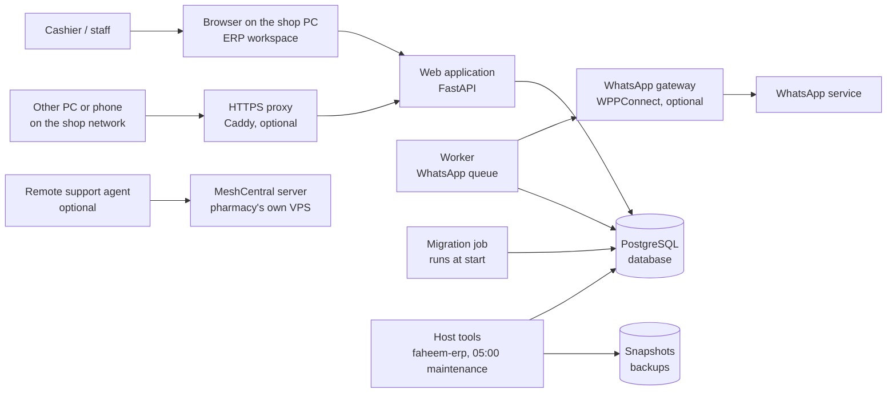
*In words:* everything runs on the pharmacy's PC. Only the proxy listens on the network, and the firewall admits
private/VPN addresses only. The database is never exposed. WhatsApp and remote support are optional add-ons.

---

## 4. Complete application flow

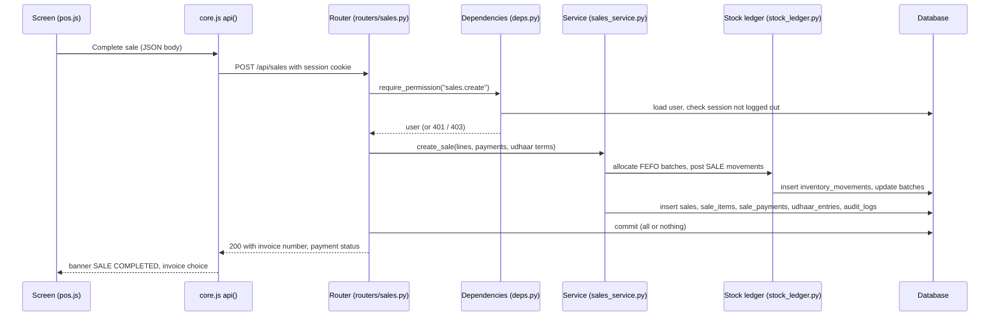
*In words:* the screen never calculates the final price. The server recalculates everything, saves it all in one
transaction, and only then answers. If any rule fails, nothing is saved and the message is shown in the status bar.

The general pattern for every feature: **screen** (`app/static/erp/<module>.js`) → **`api()`** helper
(`app/static/erp/core.js`) → **router** (`app/routers/<module>.py`) → **permission check** (`app/deps.py`) →
**service** (`app/services/<area>_service.py`) → **models / database** (`app/models.py`) → JSON answer → screen.

---

## 5. Repository structure

Only tracked, maintained folders are listed. The repository root also holds old design kits and assets that are
**not** part of the application (excluded in `.git/info/exclude`).

```
.
├── app/                     the application (backend + frontend)
│   ├── main.py              start-up, middleware, router registration
│   ├── config.py            paths, database URL, version
│   ├── database.py          engine, sessions, search index, init_db
│   ├── models.py            all database tables (49)
│   ├── permissions.py       permission catalogue and default roles
│   ├── deps.py, security.py sign-in, sessions, permission guard
│   ├── audit.py             audit log writer
│   ├── snapshot.py          whole-ERP snapshots and restore
│   ├── production.py        PostgreSQL migration job and gates
│   ├── worker.py            WhatsApp queue process
│   ├── routers/             HTTP endpoints, one file per area (20)
│   ├── services/            business logic (64 modules + whatsapp/, printing/)
│   ├── static/erp/          the workspace screens (JavaScript + CSS)
│   ├── static/brand/        logos and icons
│   └── templates/           login, ERP shell, invoice and error pages
├── alembic/versions/        44 database migrations
├── tests/                   80 test files, release fixtures (tests/fixtures/releases/*.db)
├── scripts/                 manage.py (admin CLI), release fixture builder, browser tests, CI stack test
├── deploy/appliance/        installer, faheem-erp CLI, systemd units, kiosk, proxy, firewall
├── deploy/support/          remote-support agent package (PC side)
├── deploy/support-server/   MeshCentral server kit (VPS side)
├── docs/                    this documentation
├── compose.yaml (+ .prod, .dev)  the Docker stack
└── Dockerfile, requirements.txt, alembic.ini, run.py, launch.sh
```

| Folder | Purpose | Put here | Important files | Talks to |
|---|---|---|---|---|
| `app/routers/` | Turn HTTP requests into service calls; check permissions; shape JSON | New endpoints | `erp.py` (shell, inventory, POS search), `sales.py`, `purchases.py`, `udhaar.py` | `services/`, `deps.py` |
| `app/services/` | All business rules and calculations | New rules, calculations, document logic | `stock_ledger.py`, `sales_service.py`, `purchasing.py`, `udhaar_service.py`, `report_generator.py` | `models.py`, `audit.py` |
| `app/static/erp/` | The screens, one ES module per module | New screen or UI behaviour | `shell.js` (tabs, keys, sync), `core.js` (helpers), `grid.js` (table), `pos.js` | routers via `api()` |
| `app/templates/` | Server-rendered pages | Pages outside the workspace | `erp.html` (shell + import map), `login.html`, `invoice_print.html` | `web.py` |
| `alembic/versions/` | Schema history | One migration per schema change | latest `a8c0e2f4b6d8_udhaar_manual_bills_counter.py` | `upgrade_service.py` |
| `tests/` | Automated tests | A test for each rule you add | `conftest.py`, `test_upgrades.py`, `test_end_to_end.py`, `test_udhaar.py` | the app |
| `deploy/appliance/` | Everything on the pharmacy PC outside the containers | Host scripts, systemd units | `install.sh`, `bin/faheem-erp`, `lib.sh`, `proxy/Caddyfile` | `compose.yaml` |

---

## 6. Module map

| Module | Screen | API (routers) | Services | Main tables |
|---|---|---|---|---|
| Shell, POS search, Inventory, Masters | `shell.js`, `inventory.js`, `masters.js` | `erp.py`, `inventory.py` | `inventory_service`, `search`, `packaging_*`, `uom_service`, `category_service`, `form_service`, `keymap_service` | `items`, `batches`, `categories`, `item_forms`, `product_packagings`, `item_uoms` |
| POS | `pos.js`, `studio.js` | `sales.py` | `sales_service`, `stock_ledger`, `parking_service`, `customer_service`, `invoice_kit` | `sales`, `sale_items`, `sale_payments`, `parked_sales` |
| Sales history | `sales.js` | `sales_history.py`, `sales.py` | `sales_service`, `refund_service`, `report_document` | `sales`, `sale_returns`, `sale_return_items` |
| Udhaar Ledger *(1.10.0)* | `udhaar.js` | `udhaar.py` | `udhaar_service` | `udhaar_entries`, `udhaar_payments`, `udhaar_reminders` |
| Counter Report *(1.10.0)* | `counter.js` | `udhaar.py` (`/api/erp/counter`) | `counter_service` | `counter_day_closes` (+ reads sales, returns, Udhaar) |
| Manual Bills *(1.10.0)* | `manualbills.js` | `manual_bills.py` | `manual_bill_service` | `manual_bills`, `manual_bill_items` |
| Purchases | `purchases.js`, `purchase.js`, `physical-units.js` | `purchases.py` | `purchasing`, `purchase_automation`, `purchase_engine`, `purchase_import`, `column_mapper`, `pdf_invoice`, `pdf_tables`, `ocr`, `product_matcher`, `matching`, `receipt_decision`, `receipt_proposer`, `confidence_gate`, `mapping_store`, `supplier_profiles`, `gst`, `purchase_service` | `purchases`, `purchase_items`, `suppliers`, `supplier_product_maps`, `supplier_packaging_aliases`, `supplier_invoice_profiles`, `mapping_history`, `import_metrics`, `purchase_returns` |
| Stock history / Adjustments | `history.js`, `ledger.js`, `adjustments.js` | `stock_history.py`, `adjustments.py`, `inventory.py` | `stock_ledger`, `adjustment_service` | `inventory_movements`, `stock_adjustments` |
| Customers | `customers.js`, `followup.js` | `customers.py`, `sales.py` | `customer_service`, `followup_service` | `customers`, `customer_followups` |
| Racks | `racks.js`, `locations.js` | `locations.py` | `location_service`, `location_report` | `racks`, `rack_boxes`, `item_locations`, `location_events` |
| Reports | `reports.js` | `reports.py`, `financials.py` | `report_generator`, `report_extra`, `location_report`, `report_document`, `financials`, `inventory_pricing` | reads everything |
| Settings, WhatsApp, Invoice Store | `settings.js`, `whatsapp.js` | `whatsapp.py`, `invoice_store.py`, `system.py`, `assets.py` | `whatsapp/service`, `whatsapp/provider`, `invoice_premium`, `settings_service` | `settings`, `whatsapp_messages` |
| Workspace / multi-counter | `shell.js` | `workspace.py`, `erp.py` (`/api/erp/sync`) | `sync_service` | `workspace_snapshots`, `sync_versions` |

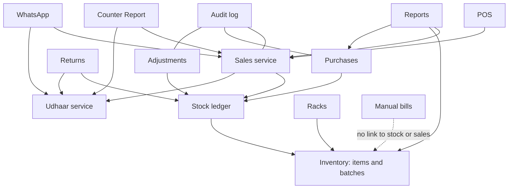
*In words:* the stock ledger is the centre; sales, returns, purchases and adjustments are the only things that
change stock, and they all go through it. Manual bills may refer to a product for its name, but nothing else.

---

## 7. API architecture

All application APIs return JSON. Pages (`/app`, `/login`, invoice pages) return HTML.

- **Authentication:** a signed session cookie `pharmacy_session` (HTTP-only). See [§9](#9-authentication--authorization).
- **Authorisation:** almost every endpoint depends on `require_permission("<code>")` (`app/deps.py`), which answers
  **401** (not signed in → redirected to `/login`) or **403** (missing permission).
- **Validation:** request bodies are read as JSON and validated inside services; a broken rule raises a service error
  (`SaleError`, `UdhaarError`, `RefundError`…) that the router turns into **400** with a plain-English `detail`.
- **Errors:** `{"detail": "<message>"}`. The screen shows `detail` in the status bar (`core.js` `api()` → `ApiError`).
- **Caching:** every `/api/` answer carries `Cache-Control: no-store` (middleware in `app/main.py`).
- **Idempotency:** POS sends a `client_request_id`; resubmitting returns the same bill.

Key endpoints:

| Method | Endpoint | Purpose | Permission |
|---|---|---|---|
| POST | `/login`, `/login/2fa`, `/logout` | Sign in, second factor, sign out | Public |
| GET | `/app` | The workspace shell (boot data, permissions, keymap) | Signed in |
| GET | `/api/erp/pos/search?q=` | Product search with sellable batches | `sales.create` |
| POST | `/api/sales` | Create a sale (or, from an old screen, a manual bill) | `sales.create` |
| PUT | `/api/sales/{id}` | Edit a completed bill | `sales.void` |
| POST | `/api/sales/{id}/refund` | Record a return / refund | `sales.refund` |
| POST | `/api/erp/sales/{id}/void` | Void a bill | `sales.void` |
| GET | `/api/erp/sales` | Sales register with filters | `sales.view_own` (own) / `sales.view_history` (all) |
| GET | `/api/erp/udhaar` | Udhaar Ledger rows and totals *(1.10.0)* | `udhaar.view` |
| POST | `/api/erp/udhaar/customers/{id}/receive` | Receive an Udhaar payment *(1.10.0)* | `udhaar.receive` |
| GET | `/api/erp/counter?day=` | Counter Report for a business day *(1.10.0)* | `reports.counter` |
| POST | `/api/erp/manual-bills` | Create a manual bill *(1.10.0)* | `sales.create` |
| POST | `/api/erp/purchases/import` | Import a supplier invoice file | `purchase.create` |
| POST | `/api/erp/purchases/{id}/post` | Post a reviewed purchase into stock | `purchase.post` |
| GET | `/api/erp/inventory` | Product list with filters (+ totals on the first page) | `inventory.view` |
| POST | `/reports/api/generate` | Generate a report | `reports.sales` (each report also checks its own) |
| GET | `/api/erp/sync` | Change counters for live refresh | Signed in |
| GET | `/health/ready` | Readiness for the container health check | Public |

**The complete list of all 217 endpoints, with their access rule and handler, is in [Appendix A](#appendix-a--all-http-endpoints).**

---

## 8. Database architecture

49 tables, defined in `app/models.py`. Primary keys are integer `id` columns unless stated. Money is stored as
fixed-point decimal (`Numeric(12,2)`), never as floating point. All timestamps are stored in **UTC** and shown in
the pharmacy's timezone (`timezone` setting, default `Asia/Kolkata`).

### 8.1 Sales, payments, returns and Udhaar

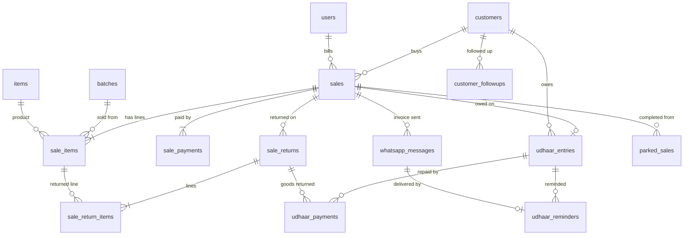
*In words:* a **sale** (bill) has one or more **lines**; each line is one batch of one product (a cashier line that
spans two batches becomes two rows with the same `line_no`). A sale is paid by one or more **payment rows**
(`CASH`, `UPI`, `CARD`, `UDHAAR`). The `UDHAAR` part is also written as one **Udhaar entry** (one per bill at most),
which collects **repayments** and **reminders**. A **return** is a separate document linked to the sale and to the
exact lines returned.

### 8.2 Inventory, purchases and stock ledger

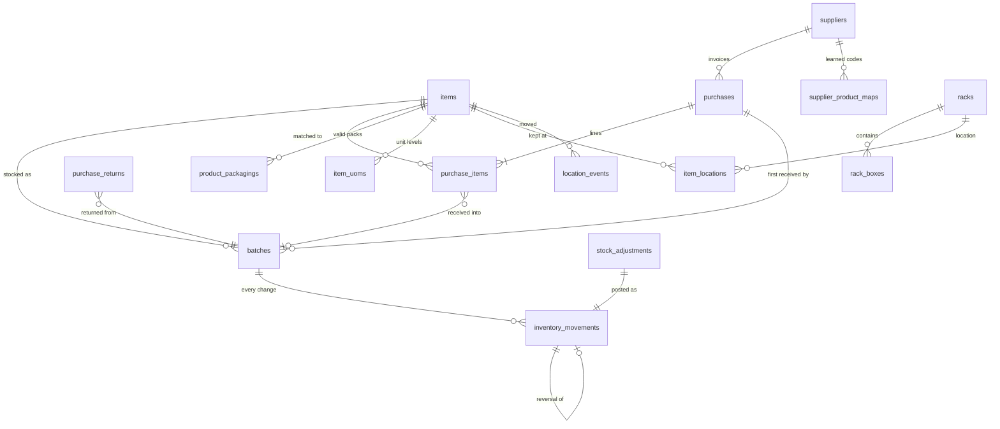
*In words:* a **product** (`items`) is stocked in **batches** (batch number + expiry + MRP + cost). A batch's stock
is the sum of its **inventory movements**, the ledger. Purchases, sales, returns, adjustments and voids each add
movements; a mistake is corrected by a **reversal** movement, never by editing or deleting. **Locations** (rack / box)
are separate dated records that never touch stock.

### 8.3 People, security and system

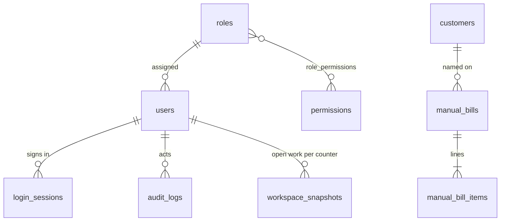
*In words:* each **user** has one **role**; a role holds many **permissions**. Every sign-in creates a
**login session** that a logout or password reset ends. Every change is written to the **audit log**.
**Manual bills** (1.10.0) live apart from sales and link only to the customer and, for reference, a product.

### 8.4 Tables by area

| Area | Tables |
|---|---|
| Sales | `sales`, `sale_items`, `sale_payments`, `sale_returns`, `sale_return_items`, `parked_sales` |
| Udhaar / counter *(1.10.0)* | `udhaar_entries`, `udhaar_payments`, `udhaar_reminders`, `counter_day_closes` |
| Manual bills *(1.10.0)* | `manual_bills`, `manual_bill_items` |
| Inventory | `items`, `batches`, `inventory_movements`, `stock_adjustments`, `expiry_alerts`, `item_uoms`, `product_packagings`, `categories`, `item_forms` |
| Purchases | `purchases`, `purchase_items`, `purchase_returns`, `suppliers`, `supplier_product_maps`, `supplier_packaging_aliases`, `supplier_invoice_profiles`, `mapping_history`, `import_metrics` |
| Locations | `racks`, `rack_boxes`, `item_locations`, `location_events` |
| Customers | `customers`, `customer_followups` |
| People / security | `users`, `roles`, `permissions`, `role_permissions`, `login_sessions`, `audit_logs` |
| System | `settings`, `number_sequences`, `sync_versions`, `workspace_snapshots`, `whatsapp_messages`, `notifications`, `deployment_log` |

### 8.5 Important constraints

| Constraint | Meaning | Source |
|---|---|---|
| `sales.invoice_no` unique; `sales.client_request_id` unique | One number per bill; a retried submission cannot create a second bill | `models.Sale` |
| `batches (item_id, batch_no, expiry_date)` unique | A batch is identified by product, number and expiry | `models.Batch` |
| `purchases`: one POSTED / PARTIAL purchase per supplier invoice number | The same supplier invoice cannot be received twice | partial index in `models.Purchase` |
| `udhaar_entries.sale_id` unique | At most one Udhaar entry per bill | `models.UdhaarEntry` |
| `item_locations`, `rack_boxes (rack_id, id)` composite key | A box must belong to its rack (trigger on SQLite) | `models`, migration `e3a5c7e9b1d4` |
| `users.username` and `employee_id` unique | | `models.User` |
| `counter_day_closes.business_date` primary key | One frozen report per day | `models.CounterDayClose` |

Human-readable numbers come from `app/sequences.py` (`number_sequences` table): `INV-YYYYMMDD-NNNN` (sale),
`MB-YYYYMMDD-NNNN` (manual bill), `RFND-YYYYMMDD-NNNN` (refund), `PUR-NNNNNN` (purchase), `PR-NNNNNN` (purchase return),
customer IDs and article codes.

---

## 9. Authentication & authorization

| Topic | How it works | Source |
|---|---|---|
| Sign-in | User name (case and spaces ignored) + password | `app/routers/auth.py`, `security.find_user` |
| Passwords | bcrypt hash; never stored or logged in plain text | `app/security.py` |
| Lock-out | 5 failures → locked 15 minutes (also for password reset) | `auth.py` `MAX_FAILURES, LOCK_MINUTES` |
| 2FA | TOTP (RFC 6238) authenticator codes; enrolment forced at first login; recovery codes (hashed); secret encrypted at rest (Fernet); code reuse in the same time step refused | `app/services/mfa.py` |
| When the code is asked | Always over HTTPS (other PCs via the proxy); on the local PC only if `mfa_at_login=true` | `auth.py` `login` |
| Session | Signed cookie `pharmacy_session` (`uid`, `sid`), HTTP-only, SameSite=Lax, `Secure` over HTTPS, valid 12 hours; each request also checks the `login_sessions` row is still open | `security.py`, `deps.get_current_user` |
| Logout / reset | Logout and password reset close the session row, so old cookies stop working | `auth.py`, `deps.py` |
| Permissions | `require_permission(code)` on each endpoint; the screen also receives a `can` map to hide what a user cannot do | `deps.py`, `routers/erp.py` `_boot` |
| Admin access | `settings.manage` (Administrator only by default) | `app/permissions.py` |
| Production secret | The migration job refuses to run without a unique session secret (≥ 32 characters) | `app/production.py` `migrate` |

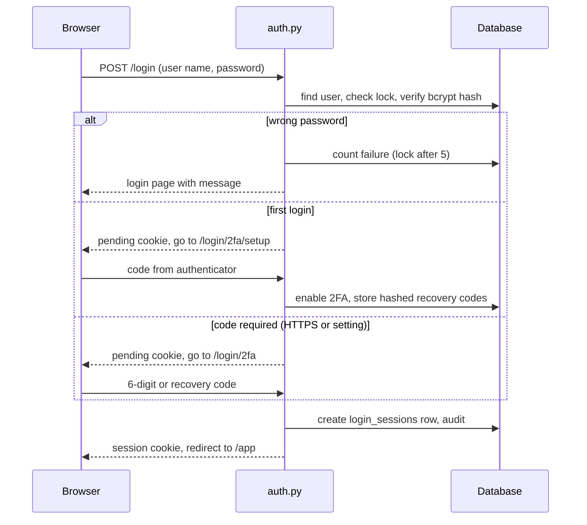

---

## 10. Data flow

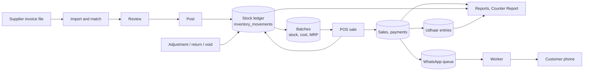
*In words:* stock enters through posted purchases and leaves through sales; every movement is recorded once in the
ledger. Reports read the stored documents and movements; they never change data. Purchase cost is snapshotted on
each sale line at the time of sale (`financials.snapshot_allocation`), so profit stays fixed even if a batch's rate
is corrected later.

---

## 11. Integrations

| Service | Purpose | Direction | Authentication | Source | Failure handling |
|---|---|---|---|---|---|
| WhatsApp (WPPConnect gateway) | Customer-requested invoices; Udhaar reminders and statements *(1.10.0)* | ERP → gateway → WhatsApp | Shared secret `PHARMACY_WPP_SECRET` → bearer token; gateway URL must be local/private | `app/services/whatsapp/provider.py`, `service.py` | Queue with 3 attempts (30 s, 2 min backoff), permanent failures stored with reason; billing never waits |
| MeshCentral | Remote desktop for support | PC agent → pharmacy-owned server | Enrolment link, 2FA on server, local consent | `deploy/support/`, `deploy/support-server/`, [REMOTE-SUPPORT.md](REMOTE-SUPPORT.md) | Inactive until installed; repair command |
| AI invoice reader (optional) | Read invoice layouts the mapper cannot | ERP → model API | API key in settings (`invoice_ai_key`) or `ANTHROPIC_API_KEY` | `app/services/invoice_agent.py` | Off by default |
| Tesseract OCR (local) | Scanned invoices | Local program | — | `app/services/ocr.py` | Off by default (`purchase_scan_import`) |
| Printing | Plain-text invoice to a local printer | Local | — | `app/services/printing/` | Result reported to the screen |

---

## 12. Background jobs and automation

| Job | Runs | What it does | Source |
|---|---|---|---|
| Worker (`python -m app.worker`) | Continuously (own container) | Delivers due WhatsApp messages, writes a heartbeat file every 10 s | `app/worker.py`, `app/main.py` `_whatsapp_worker` |
| Daily jobs | Every ~2 minutes inside the worker loop *(1.10.0)* | Freezes finished business days (Counter Report); sends automatic Udhaar reminders if `udhaar_auto_reminders=true` | `app/main.py` `daily`, `counter_service.close_finished_days`, `udhaar_service.send_due_reminders` |
| WhatsApp keep-alive | Every 2 minutes | Restarts a dropped paired session | `whatsapp/service.keep_connected` |
| Migration job | Once at every stack start | Migrate, verify schema | `app/production.py` (compose `migrate` service) |
| Maintenance | Daily 05:00 store time | Backup, optimise, health, reboot | `deploy/appliance/systemd/faheem-erp-maintenance.timer`, `bin/maintenance.sh` |
| Boot check | After boot | Starts the stack and records status | `faheem-erp-boot-check.timer`, `bin/boot-check.sh` |
| Development snapshots | Periodically and at shutdown (SQLite only) | Whole-ERP snapshot | `app/main.py` `_snapshot_loop` |
| Start-up tasks | Each web start | Unit-of-measure auto-configuration, purchase engine bootstrap (once per database) | `app/main.py` |

---

## 13. Configuration

| File | Purpose |
|---|---|
| `app/config.py` | Paths, database URL, version (`APP_VERSION`), session cookie name |
| `settings` table | Store settings (pharmacy details, limits, rounding, timezone, WhatsApp, Udhaar…), read via `app/services/settings_service.py`; changed with `scripts/manage.py setting` or the Settings screen |
| `compose.yaml`, `compose.prod.yaml`, `compose.dev.yaml` | The Docker stack and its environment |
| `/etc/faheem-erp/faheem.env` (on the appliance, not in Git) | Secrets and stack variables |
| `deploy/appliance/dev.env` | Development values for the stack |
| `.env.example` | Placeholder example of environment variables |
| `alembic.ini` | Alembic configuration |
| `deploy/appliance/proxy/Caddyfile` | HTTPS proxy |

## 14. Environment variables

Secrets are never stored in the repository. Examples use placeholders.

| Variable | Purpose | Required | Example |
|---|---|---|---|
| `PHARMACY_DATABASE_URL` | Database connection | Appliance: yes (set by compose) | `postgresql+psycopg://faheem:<password>@postgres:5432/faheem` |
| `PHARMACY_DB` | SQLite file when no URL is set | No | `data/pharmacy.db` |
| `PHARMACY_SECRET_KEY` | Signs session cookies and encrypts 2FA secrets | **Yes in production** (≥ 32 chars, checked) | `<random 64 chars>` |
| `PHARMACY_ADMIN_PASSWORD` | Password of the first administrator on a fresh database | Fresh install only | `<strong password>` |
| `PHARMACY_DATA_DIR`, `PHARMACY_UPLOAD_DIR`, `PHARMACY_LOG_DIR` | Where data, uploaded files and logs live | No (defaults under the project) | `/var/lib/faheem-erp/application-data` |
| `PHARMACY_SNAPSHOT_DIR`, `PHARMACY_SNAPSHOT_MIRROR` | Snapshot store and optional mirror | No | `/var/backups/faheem-erp/snapshots` |
| `PHARMACY_TIMEZONE` | Default business timezone | No | `Asia/Kolkata` |
| `PHARMACY_HOST`, `PHARMACY_PORT` | Development server address | No | `127.0.0.1`, `8000` |
| `PHARMACY_PRODUCTION` | Enables production checks | Appliance | `1` |
| `PHARMACY_EXTERNAL_MIGRATIONS` | Web app does not migrate; waits for the migration job | Appliance | `1` |
| `PHARMACY_EXTERNAL_WORKER` | Web app does not run the WhatsApp worker itself | Appliance | `1` |
| `PHARMACY_BACKUPS` | `0` disables in-app snapshots (host does backups) | Appliance | `0` |
| `PHARMACY_SKIP_MIGRATIONS` | Tests: create tables directly, no migrations | Tests only | `1` |
| `PHARMACY_APPLIANCE_STATE` | Status file shown in Settings → System | Appliance | `/var/lib/faheem-erp/state/status.json` |
| `PHARMACY_WPP_URL`, `PHARMACY_WPP_SECRET`, `PHARMACY_WPP_SESSION` | WhatsApp gateway address, shared secret, session name | For WhatsApp | `http://whatsapp:21465`, `<secret>`, `faheem-pharmacy` |
| `PHARMACY_TESSERACT` | Path to the OCR program | No | `/usr/bin/tesseract` |
| `PHARMACY_PDF_TEXT_MIN_CHARS` | Characters per page below which a PDF counts as scanned (default 25) | No | `25` |
| `PHARMACY_NO_OFFLOAD` | Disable worker-thread offloading (debugging) | No | `1` |
| `PHARMACY_ENV_FILE` | Env file read by the snapshot tool | No | `/etc/faheem-erp/faheem.env` |
| `FAHEEM_OWNER_USERNAME`, `FAHEEM_OWNER_PASSWORD`, `FAHEEM_OWNER_FULL_NAME` | Owner account created by the installer | Install only | `<owner>` |
| `ANTHROPIC_API_KEY` | Optional AI invoice reader | No | `<api key>` |
| `GIT_COMMIT`, `BUILD_DATE` | Build identity shown in system info | No | `ff68a2d` |
| Compose: `POSTGRES_PASSWORD`, `FAHEEM_VERSION`, `FAHEEM_IMAGE`, `FAHEEM_BIND`, `FAHEEM_PORT`, `FAHEEM_DATA`, `FAHEEM_LOGS`, `FAHEEM_BACKUPS`, `FAHEEM_TIMEZONE`, `FAHEEM_HOSTNAME`, `FAHEEM_LAN_IP`, `FAHEEM_LAN_BIND` | Stack settings in `faheem.env` | Appliance | `FAHEEM_BIND=127.0.0.1` |

---

## 15. Deployment architecture

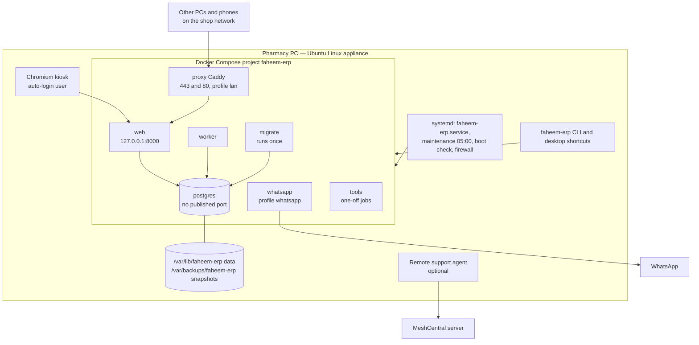
*In words:* the PC boots into a kiosk browser showing the ERP. Docker runs the database, the one-off migration job,
the web app and the worker; the WhatsApp gateway and the network proxy are optional profiles. The host's firewall
admits only private/VPN addresses to the proxy. Containers run as an unprivileged user with all Linux capabilities
dropped.

- **Install:** `deploy/appliance/install.sh` ([INSTALL.md](INSTALL.md)).
- **Update:** `faheem-erp update` / desktop *Force Update ERP* builds from the newest `prod` commit, rehearses migrations on a copy, takes a verified snapshot, migrates, checks health, rolls back on failure ([UPDATE.md](UPDATE.md)).
- **Branches:** `dev` (development) and `prod` (what the pharmacy PC installs).
- **CI:** `scripts/ci/stack-test.sh` (fresh stack install + smoke test). GitHub workflow files exist only on a local branch (`dev-before-purchase-update-3e893ce`), not in `dev`; see [TASKS.md](TASKS.md).

---

## 16. Startup sequence

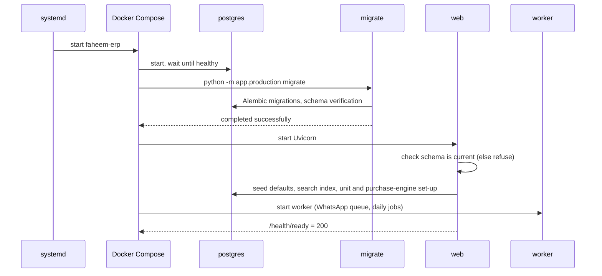
*In words:* the web app never starts on a database whose migrations have not finished. In **development** (SQLite,
`launch.sh` / `run.py`) the web app itself runs the guarded upgrade: integrity check → snapshot → fingerprint →
migrate → compare → automatic restore if anything differs (`app/main.py` `lifespan`, `database.init_db`,
`upgrade_service.upgrade`).

---

## 17. Error handling

| Where | Behaviour | Source |
|---|---|---|
| Business rule broken | Service raises its error class → router returns 400 with `detail` → status bar shows it in red | `app/services/*`, `app/routers/*`, `core.js` |
| Not signed in | 401 → redirect to `/login?next=…` (the screen follows it) | `app/main.py` handler, `core.js` |
| Missing permission | 403 → error page (pages) or message (API) | `app/main.py` |
| Database transaction | Each request commits once; on error the router rolls back, so no half-saved documents | routers (`db.rollback()`) |
| Duplicate submission | Unique `client_request_id` → the existing bill is returned | `routers/sales.py` |
| WhatsApp delivery | Temporary errors retried, permanent errors stored | `whatsapp/service.process_due` |
| Failed migration | Automatic restore of the pre-upgrade snapshot; start-up stops with a message | `upgrade_service.upgrade` |
| Corrupt SQLite file | Start-up refused with restore instructions | `app/main.py` `_startup_integrity` |
| Logging | Python `logging` to standard output (INFO); on the appliance kept by Docker (10 MB × 5 per service); upgrades also go to `deployment_log` and `logs/deployments.log` | `app/main.py`, `compose.yaml`, `upgrade_service.py` |

---

## 18. Security architecture

**Existing controls**

| Control | Implementation |
|---|---|
| Authentication | Password (bcrypt) + TOTP 2FA, lock-out, session rows that can be ended ([§9](#9-authentication--authorization)) |
| Authorisation | Permission check on every endpoint; 49 permission codes; least-privilege default roles |
| Session security | Signed HTTP-only cookie, SameSite=Lax, Secure over HTTPS, 12-hour lifetime |
| Secrets | From `faheem.env` / environment; production refuses the development secret; 2FA secrets encrypted |
| Input handling | SQLAlchemy parameterised queries; services validate values (quantities, money, dates); HTML output escaped (`esc()` in `core.js`, Jinja2 autoescape) |
| Database access | Database container has no published port; reachable only on the stack network |
| Network exposure | Web bound to 127.0.0.1; only the optional proxy listens on the LAN; host firewall (`firewall.sh`, `DOCKER-USER` rules) admits private/VPN ranges |
| Containers | Non-root user 10001, `cap_drop: ALL`, `no-new-privileges` |
| WhatsApp gateway | Refuses non-local/non-private gateway URLs; manager UI disabled; no published port |
| Audit | `audit_logs` on every change, with user, IP, before / after |
| CORS | Not enabled for the API. Only `/health/ready` answers any origin (needed by the kiosk loading page; it returns no data) |

**Security observations** (not changed by this documentation; tracked in [TASKS.md](TASKS.md))

- No anti-CSRF token (CSRF: *Cross-Site Request Forgery*, a hostile page making the browser send requests). Protection relies on the SameSite=Lax cookie and JSON request bodies. *Needs investigation* for form-encoded endpoints.
- The development default `PHARMACY_SECRET_KEY` is in `app/config.py`; it is refused only by the production migration job, not by a development server started on a network address.
- `SECURITY.md` says the repository is private; the repository's actual visibility is not confirmed from the codebase.
- No general rate limiting beyond the per-account login lock.
- PyMuPDF is AGPL-licensed (licence, not security; see [`DEPENDENCIES.md`](../DEPENDENCIES.md)).

---

## 19. Codebase map

| Question | Answer |
|---|---|
| Where does the application start? | `app/main.py` (`create_app`, `lifespan`); container command `uvicorn app.main:app`; development `run.py` / `launch.sh` |
| Where is the frontend? | `app/static/erp/*.js` + `erp.css`, loaded by `app/templates/erp.html` (import map) |
| Where is the backend? | `app/` (FastAPI) |
| Where are APIs defined? | `app/routers/*.py` (+ `app/system.py`, health in `app/main.py`) |
| Where is business logic? | `app/services/` |
| Where is database access? | SQLAlchemy sessions from `app/database.py` (`get_db`), used in routers and services |
| Where are models? | `app/models.py` |
| Where is authentication? | `app/routers/auth.py`, `app/security.py`, `app/services/mfa.py`, `app/deps.py` |
| Where are permissions? | `app/permissions.py` (catalogue, roles), `app/deps.py` (`require_permission`), `routers/erp.py` (`MODULE_PERMS`, `CAPABILITIES`) |
| Where are reusable UI components? | `app/static/erp/core.js` (helpers, `modal`, `api`), `grid.js` (table), `studio.js` (invoice studio), `followup.js`, `whatsapp.js`, `locations.js` |
| Where is configuration? | `app/config.py`, `settings` table via `settings_service.py`, `compose.yaml` |
| Where are tests? | `tests/` (pytest), `scripts/test-*-browser.mjs` (Playwright) |
| Where are integrations? | `app/services/whatsapp/`, `app/services/invoice_agent.py`, `app/services/ocr.py`, `deploy/support/` |
| Where are deployment files? | `Dockerfile`, `compose*.yaml`, `deploy/appliance/` |
| Where should a new feature go? | Model in `app/models.py` + migration in `alembic/versions/` → rules in a service in `app/services/` → endpoint in `app/routers/` (register in `app/main.py`) → permission in `app/permissions.py` (+ migration grant) → screen in `app/static/erp/` (register in `shell.js` `MODULES`, `erp.html` import map, `routers/erp.py` `MODULE_PERMS`) → shortcuts in `keymap_service.ACTIONS` → tests in `tests/` |

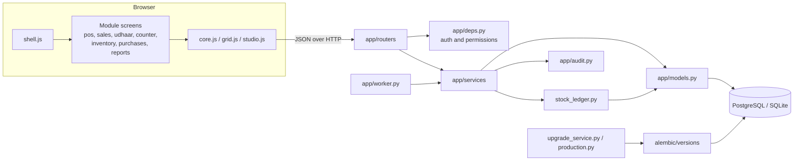

---

## Appendix A — All HTTP endpoints

Generated from the running application's route table (217 endpoints). **Access** shows the permission the endpoint
requires; *Signed in* means any signed-in user; *Public* means no sign-in. The handler is the Python function to open.
Some endpoints additionally restrict data by permission inside the handler (for example, sales history shows only the
user's own bills without `sales.view_history`).

#### `app/routers/auth.py`

| Method | Endpoint | Access | Handler — purpose |
|---|---|---|---|
| GET | `/login` | Public | `login_page` |
| POST | `/login` | Public | `login` |
| GET | `/login/2fa` | Public | `code_page` |
| POST | `/login/2fa` | Public | `code_check` |
| POST | `/login/2fa/done` | Public | `setup_done` |
| GET | `/login/2fa/setup` | Public | `setup_page` |
| POST | `/login/2fa/setup` | Public | `setup_confirm` |
| GET | `/login/reset` | Public | `reset_page` |
| POST | `/login/reset` | Public | `reset_password` |
| POST | `/logout` | Public | `logout` |

#### `app/system.py`

| Method | Endpoint | Access | Handler — purpose |
|---|---|---|---|
| GET | `/api/erp/settings/system` | `settings.manage` | `information` |
| GET | `/api/v1/system/version` | `settings.manage` | `system_version` |
| GET | `/health/live` | Public | `live` |
| GET | `/health/ready` | Public | `ready` |

#### `app/main.py`

| Method | Endpoint | Access | Handler — purpose |
|---|---|---|---|
| GET | `/` | Public | `home` — The ERP workspace is the application |
| GET | `/healthz` | Public | `healthz` — Unauthenticated liveness probe for faheemctl.sh and monitoring |

#### `app/routers/erp.py`

| Method | Endpoint | Access | Handler — purpose |
|---|---|---|---|
| GET | `/api/erp/categories` | `inventory.view` | `erp_categories` |
| POST | `/api/erp/categories` | `inventory.edit` | `erp_category_create` |
| DELETE | `/api/erp/categories/{code}` | `inventory.edit` | `erp_category_delete` |
| PUT | `/api/erp/categories/{code}` | `inventory.edit` | `erp_category_update` |
| POST | `/api/erp/categories/{code}/merge` | `inventory.edit` | `erp_category_merge` |
| GET | `/api/erp/customers` | `sales.create` | `erp_customers` — POS customer lookup: digits search mobiles, text searches name / ID / doctor |
| GET | `/api/erp/inventory` | `inventory.view` | `erp_inventory` — `state`: "" (active and disabled) · active · disabled · deleted (recycle bin) |
| POST | `/api/erp/inventory` | `inventory.create` | `erp_create_item` |
| POST | `/api/erp/inventory/bulk/category` | `inventory.edit` | `erp_items_category` — Change only the category of the selected products |
| POST | `/api/erp/inventory/bulk/status` | `inventory.delete` | `erp_items_status` — The same action on many products; each one that cannot change says why, the rest change |
| GET | `/api/erp/inventory/{item_id}` | `inventory.view` | `erp_inventory_detail` |
| PUT | `/api/erp/inventory/{item_id}` | `inventory.edit` | `erp_update_item` |
| POST | `/api/erp/inventory/{item_id}/adjust` | `adjustment.create` | `erp_adjust` — Stock adjustment as a ledger transaction (never a direct overwrite) |
| POST | `/api/erp/inventory/{item_id}/status` | `inventory.delete` | `erp_item_status` |
| GET | `/api/erp/item-forms` | Signed in | `erp_item_forms` |
| POST | `/api/erp/item-forms` | Signed in | `erp_item_form_create` |
| PUT | `/api/erp/item-forms/{code}` | `inventory.edit` | `erp_item_form_update` |
| GET | `/api/erp/keymap` | Signed in | `erp_keymap` |
| PUT | `/api/erp/keymap` | Signed in | `erp_keymap_save` — Save this user's shortcut overrides (`{"overrides": {action_id: key or ""}}`) |
| GET | `/api/erp/pos/parked` | `sales.create` | `erp_parked` |
| GET | `/api/erp/pos/search` | `sales.create` | `erp_pos_search` — POS search: products with sellable batches (FEFO), MRPs, never cost |
| GET | `/api/erp/products` | `inventory.view` | `erp_products` — Product lookup for back-office pickers (every product, stocked or not) |
| GET | `/api/erp/sync` | Signed in | `erp_sync` — What changed anywhere (a counter per area): open screens on every PC refresh what moved |
| GET | `/api/erp/uom` | `inventory.view` | `erp_uom_register` — Every product's unit of measure: sale/base unit, purchase unit, conversion, content, |
| GET | `/app` | Signed in | `erp_shell` |
| GET | `/app/{rest:path}` | Signed in | `erp_shell` |

#### `app/routers/workspace.py`

| Method | Endpoint | Access | Handler — purpose |
|---|---|---|---|
| GET | `/api/erp/sales/by-request/{request_id}` | Signed in | `sale_by_request` — Was this bill already completed (e.g. just before a crash)? Bills carry a request id |
| GET | `/api/erp/workspace` | Signed in | `get_workspace` — This counter's snapshot; a counter that lost its id gets the user's most recent one |
| POST | `/api/erp/workspace` | Signed in | `post_workspace` |
| PUT | `/api/erp/workspace` | Signed in | `put_workspace` |

#### `app/routers/sales.py`

| Method | Endpoint | Access | Handler — purpose |
|---|---|---|---|
| POST | `/api/customers` | `customers.create` | `api_customer_create` |
| GET | `/api/customers/lookup` | `sales.create` | `api_customer_lookup` — Existing customer for a mobile number (formatting and +91 ignored) |
| GET | `/api/customers/mobile-search` | `sales.create` | `api_customer_mobile_search` — Live POS search: customers whose mobile contains the digits typed so far |
| GET | `/api/customers/search` | `sales.create` | `api_customer_search` |
| POST | `/api/customers/{customer_id}/type` | `sales.create` | `api_customer_set_type` — In-place category change from the POS customer strip |
| GET | `/api/erp/sales/{sale_id}/edit` | `sales.void` | `api_sale_edit_payload` — A completed bill reopened in a POS tab: its lines with every sellable batch |
| GET | `/api/erp/sales/{sale_id}/export.{fmt}` | `sales.view_own` | `sale_invoice_export` — One invoice as Excel or CSV: header facts, lines, totals and payments |
| POST | `/api/pos/park` | `sales.create` | `api_park_sale` |
| GET | `/api/pos/parked` | `sales.create` | `api_parked_list` |
| GET | `/api/pos/parked/count` | `sales.create` | `api_parked_count` |
| POST | `/api/pos/parked/{parked_id}/discard` | `sales.create` | `api_discard_parked` |
| POST | `/api/pos/parked/{parked_id}/release` | `sales.create` | `api_release_parked` |
| POST | `/api/pos/parked/{parked_id}/resume` | `sales.create` | `api_resume_parked` |
| POST | `/api/sales` | `sales.create` | `api_create_sale` |
| GET | `/api/sales/recent` | `sales.view_own` | `api_recent_sales` |
| PUT | `/api/sales/{sale_id}` | `sales.void` | `api_sale_amend` — Save an edited bill: same number, old stock back to its batches, new lines sold, fully aud |
| GET | `/api/sales/{sale_id}/invoice-view` | Signed in | `api_sale_invoice_view` — The saved invoice mapped to the customer-invoice kit's data contract |
| POST | `/api/sales/{sale_id}/refund` | `sales.refund` | `api_create_refund` |
| GET | `/api/sales/{sale_id}/refundable` | `sales.refund` | `api_refundable` |
| GET | `/api/sales/{sale_id}/refunds` | `sales.view_own` | `api_sale_refunds` |
| GET | `/sales` | `sales.view_own` | `sales_list` — The bill register lives in the ERP Sales module now |
| GET | `/sales/export/{fmt}` | `sales.export` | `export_sales` |
| GET | `/sales/returns/{return_id}/pdf` | `sales.refund` | `return_pdf` |
| GET | `/sales/{sale_id}/invoice` | `sales.view_own` | `sale_invoice_document` — The invoice rendered by the studio engine — shown inside the ERP tab (POS or Sales) |
| GET | `/sales/{sale_id}/pdf` | `sales.view_own` | `sale_pdf` |
| POST | `/sales/{sale_id}/print` | `billing.print` | `sale_print` |

#### `app/routers/sales_history.py`

| Method | Endpoint | Access | Handler — purpose |
|---|---|---|---|
| GET | `/api/erp/sales` | `sales.view_own` | `sales_register` |
| GET | `/api/erp/sales/{sale_id}` | `sales.view_own` | `sale_detail` |
| POST | `/api/erp/sales/{sale_id}/void` | `sales.void` | `sale_void` |

#### `app/routers/manual_bills.py`

| Method | Endpoint | Access | Handler — purpose |
|---|---|---|---|
| GET | `/api/erp/manual-bills` | `sales.create` | `manual_bills` |
| POST | `/api/erp/manual-bills` | `sales.create` | `manual_bill_create` |
| GET | `/api/erp/manual-bills/{bill_id}` | `sales.create` | `manual_bill_detail` |
| PUT | `/api/erp/manual-bills/{bill_id}` | `sales.void` | `manual_bill_amend` |
| POST | `/api/erp/manual-bills/{bill_id}/delete` | `sales.void` | `manual_bill_delete` |
| GET | `/api/erp/manual-bills/{bill_id}/edit` | `sales.void` | `manual_bill_edit_payload` |
| GET | `/api/erp/manual-bills/{bill_id}/export.{fmt}` | `sales.create` | `manual_bill_export` |
| GET | `/manual-bills/{bill_id}/invoice` | `sales.create` | `manual_bill_invoice` |
| GET | `/manual-bills/{bill_id}/pdf` | `sales.create` | `manual_bill_pdf` |

#### `app/routers/udhaar.py`

| Method | Endpoint | Access | Handler — purpose |
|---|---|---|---|
| GET | `/api/erp/counter` | `reports.counter` | `counter_report` |
| GET | `/api/erp/counter/documents` | `reports.counter` | `counter_documents` |
| GET | `/api/erp/udhaar` | `udhaar.view` | `udhaar_list` |
| GET | `/api/erp/udhaar/customers/{customer_id}` | `sales.create` | `udhaar_customer` — The customer's Udhaar position and proposed dates — what the POS shows when Udhaar is chos |
| GET | `/api/erp/udhaar/customers/{customer_id}/ledger` | `udhaar.view` | `udhaar_ledger` |
| POST | `/api/erp/udhaar/customers/{customer_id}/opening` | `udhaar.manage` | `udhaar_opening` |
| POST | `/api/erp/udhaar/customers/{customer_id}/receive` | `udhaar.receive` | `udhaar_receive` |
| GET | `/api/erp/udhaar/customers/{customer_id}/statement` | `udhaar.view` | `udhaar_statement` |
| POST | `/api/erp/udhaar/customers/{customer_id}/statement/whatsapp` | `udhaar.receive` | `udhaar_statement_whatsapp` |
| PUT | `/api/erp/udhaar/customers/{customer_id}/terms` | `udhaar.manage` | `udhaar_terms` |
| GET | `/api/erp/udhaar/settings` | `udhaar.view` | `udhaar_settings` |
| PUT | `/api/erp/udhaar/settings` | `udhaar.manage` | `udhaar_settings_save` |
| POST | `/api/erp/udhaar/{entry_id}/dates` | `udhaar.receive` | `udhaar_dates` |
| POST | `/api/erp/udhaar/{entry_id}/remind` | `udhaar.receive` | `udhaar_remind` |
| GET | `/api/erp/udhaar/{entry_id}/reminder-text` | `udhaar.view` | `udhaar_reminder_text` |

#### `app/routers/customers.py`

| Method | Endpoint | Access | Handler — purpose |
|---|---|---|---|
| GET | `/api/erp/customers/directory` | `customers.view` | `directory` |
| GET | `/api/erp/customers/{customer_id}` | `customers.view` | `customer_record` |
| PUT | `/api/erp/customers/{customer_id}` | `customers.edit` | `customer_update` |
| GET | `/api/erp/customers/{customer_id}/activity` | `customers.view` | `customer_activity` |
| GET | `/api/erp/customers/{customer_id}/invoices` | `customers.view` | `customer_invoices` |
| POST | `/api/erp/customers/{customer_id}/notes` | `customers.view` | `customer_note` |
| GET | `/api/erp/followups` | `customers.view` | `followups` |
| POST | `/api/erp/followups` | `followups.manage` | `followup_create` |
| POST | `/api/erp/followups/{fid}/cancel` | `followups.manage` | `followup_cancel` |
| POST | `/api/erp/followups/{fid}/complete` | `followups.manage` | `followup_complete` |
| POST | `/api/erp/followups/{fid}/reschedule` | `followups.manage` | `followup_reschedule` |

#### `app/routers/purchases.py`

| Method | Endpoint | Access | Handler — purpose |
|---|---|---|---|
| GET | `/api/erp/medicine-reference` | `purchase.view` | `medicine_reference` |
| GET | `/api/erp/purchase-products` | `purchase.view` | `purchase_products` — Product picker for matching a supplier line (every product, stocked or not) |
| GET | `/api/erp/purchase-returns` | `purchase.view` | `purchase_returns` |
| POST | `/api/erp/purchase-returns` | `purchase.return` | `purchase_return_create` |
| GET | `/api/erp/purchase-returns/batches` | `purchase.return` | `purchase_return_batches` |
| GET | `/api/erp/purchases` | `purchase.view` | `purchase_register` |
| POST | `/api/erp/purchases` | `purchase.create` | `purchase_create` |
| GET | `/api/erp/purchases/fields` | `purchase.view` | `purchase_fields` — What a supplier column can mean (for the Columns window) |
| POST | `/api/erp/purchases/import` | `purchase.create` | `purchase_import` |
| GET | `/api/erp/purchases/template.csv` | `purchase.view` | `purchase_template` |
| DELETE | `/api/erp/purchases/{purchase_id}` | `purchase.create` | `purchase_delete` |
| GET | `/api/erp/purchases/{purchase_id}` | `purchase.view` | `purchase_detail` |
| PUT | `/api/erp/purchases/{purchase_id}` | `purchase.create` | `purchase_update` |
| POST | `/api/erp/purchases/{purchase_id}/cancel` | `purchase.create` | `purchase_cancel` |
| POST | `/api/erp/purchases/{purchase_id}/close` | `purchase.post` | `purchase_close` |
| PUT | `/api/erp/purchases/{purchase_id}/columns` | `purchase.create` | `purchase_columns` |
| GET | `/api/erp/purchases/{purchase_id}/decisions` | `purchase.view` | `purchase_decisions` |
| POST | `/api/erp/purchases/{purchase_id}/lines` | `purchase.create` | `purchase_add_line` |
| POST | `/api/erp/purchases/{purchase_id}/lines/bulk` | `purchase.create` | `purchase_bulk` — Same correction on many lines: {line_ids, changes} — or confirmed matches {matches: {line_ |
| POST | `/api/erp/purchases/{purchase_id}/lines/category` | `purchase.create` | `purchase_lines_category` — Change only the category of the selected lines' products |
| POST | `/api/erp/purchases/{purchase_id}/lines/location` | `rack.assign` | `purchase_lines_location` — Where the selected lines' stock goes: one rack / box, or each line's suggestion (`suggest |
| POST | `/api/erp/purchases/{purchase_id}/lines/suggest` | `purchase.view` | `purchase_suggest_many` |
| DELETE | `/api/erp/purchases/{purchase_id}/lines/{line_id}` | `purchase.create` | `purchase_delete_line` |
| PUT | `/api/erp/purchases/{purchase_id}/lines/{line_id}` | `purchase.create` | `purchase_correct` |
| GET | `/api/erp/purchases/{purchase_id}/lines/{line_id}/inspect` | `purchase.view` | `purchase_line_inspect` — Match Inspector: the signals behind the line's product and pack decisions |
| PUT | `/api/erp/purchases/{purchase_id}/lines/{line_id}/invoice-unit` | `purchase.create` | `purchase_invoice_unit` |
| GET | `/api/erp/purchases/{purchase_id}/lines/{line_id}/packaging` | `purchase.view` | `purchase_line_packaging` |
| PUT | `/api/erp/purchases/{purchase_id}/lines/{line_id}/packaging` | `purchase.create` | `purchase_line_packaging_save` — Correction dialog: what one invoice Qty is, saved for this invoice, the product or the sup |
| PUT | `/api/erp/purchases/{purchase_id}/lines/{line_id}/physical-quantity` | `purchase.create` | `purchase_physical_quantity` |
| GET | `/api/erp/purchases/{purchase_id}/lines/{line_id}/suggestions` | `purchase.view` | `purchase_suggestions` |
| POST | `/api/erp/purchases/{purchase_id}/post` | `purchase.post` | `purchase_post` |
| POST | `/api/erp/purchases/{purchase_id}/prepare` | `purchase.create` | `purchase_prepare` |
| POST | `/api/erp/purchases/{purchase_id}/rollback` | `purchase.post` | `purchase_rollback` — Posted lines back to review: their stock is reversed through the ledger |
| GET | `/api/erp/purchases/{purchase_id}/source` | `purchase.view` | `purchase_source` |
| GET | `/api/erp/suppliers` | `inventory.view` | `supplier_list` |
| POST | `/api/erp/suppliers` | `supplier.manage` | `supplier_create` |
| PUT | `/api/erp/suppliers/{supplier_id}` | `supplier.manage` | `supplier_update` |
| GET | `/api/erp/suppliers/{supplier_id}/mappings` | `purchase.view` | `supplier_mappings` |
| DELETE | `/api/erp/suppliers/{supplier_id}/mappings/{map_id}` | `supplier.manage` | `supplier_mapping_delete` |

#### `app/routers/inventory.py`

| Method | Endpoint | Access | Handler — purpose |
|---|---|---|---|
| POST | `/api/erp/inventory/import` | `inventory.create` | `item_import` — Create products and post opening stock from a CSV / Excel sheet (one result per row) |
| GET | `/api/erp/inventory/import/template.csv` | `inventory.create` | `item_import_template` |
| GET | `/api/items/search` | Signed in | `api_item_search` |
| GET | `/api/items/{item_id}/batches` | Signed in | `api_item_batches` |
| GET | `/api/items/{item_id}/ledger` | `inventory.view` | `api_item_ledger` — Stock movement history (newest first) for a product or one batch |
| GET | `/inventory/export/{fmt}` | `inventory.export` | `export_inventory` |

#### `app/routers/stock_history.py`

| Method | Endpoint | Access | Handler — purpose |
|---|---|---|---|
| GET | `/api/erp/stock-history` | `inventory.view` | `stock_history` |
| GET | `/api/erp/stock-history.csv` | `inventory.export` | `stock_history_csv` |

#### `app/routers/adjustments.py`

| Method | Endpoint | Access | Handler — purpose |
|---|---|---|---|
| GET | `/adjustments` | `adjustment.create` | `adjustments_page` |
| GET | `/api/erp/adjustments` | `inventory.view` | `adjustment_register` |
| POST | `/api/erp/adjustments` | `adjustment.create` | `adjustment_create` |
| POST | `/api/erp/adjustments/{adjustment_id}/reverse` | `adjustment.create` | `adjustment_reverse` |

#### `app/routers/locations.py`

| Method | Endpoint | Access | Handler — purpose |
|---|---|---|---|
| PUT | `/api/erp/boxes/{box_id}` | `box.manage` | `box_update` |
| POST | `/api/erp/boxes/{box_id}/status` | `box.manage` | `box_status` |
| GET | `/api/erp/inventory/{item_id}/location` | `rack.view` | `item_location` |
| POST | `/api/erp/locations/assign` | `rack.assign` | `assign` — Put products in a rack / box (`rack_id` null = unassign). One request whatever the count |
| GET | `/api/erp/locations/options` | `rack.view` | `location_options` — Active racks and their active boxes, for the location pickers |
| GET | `/api/erp/locations/settings` | `rack.view` | `location_settings` |
| PUT | `/api/erp/locations/settings` | `rack.edit` | `location_settings_save` |
| GET | `/api/erp/racks` | `rack.view` | `racks` |
| POST | `/api/erp/racks` | `rack.create` | `rack_create` |
| GET | `/api/erp/racks/{rack_id}` | `rack.view` | `rack_detail` |
| PUT | `/api/erp/racks/{rack_id}` | `rack.edit` | `rack_update` |
| POST | `/api/erp/racks/{rack_id}/boxes` | `box.manage` | `box_create` |
| GET | `/api/erp/racks/{rack_id}/history` | `rack.history.view` | `rack_history` |
| GET | `/api/erp/racks/{rack_id}/products` | `rack.view` | `rack_products` — Products in a rack (`box`: a box id, or `none` for those without a box) |
| GET | `/api/erp/racks/{rack_id}/snapshot` | `rack.snapshot.view` | `rack_snapshot` — The rack's contents at the close of `day` (local time), from history — not today's state |
| POST | `/api/erp/racks/{rack_id}/status` | `rack.disable` | `rack_status` |
| GET | `/api/erp/racks/{rack_id}/timeline` | `rack.snapshot.view` | `rack_timeline` |

#### `app/routers/reports.py`

| Method | Endpoint | Access | Handler — purpose |
|---|---|---|---|
| GET | `/reports` | `reports.sales` | `reports_page` |
| GET | `/reports/api/catalog` | `reports.sales` | `report_catalog` |
| GET | `/reports/api/document/{token}.{fmt}` | `reports.export` | `download_document` |
| POST | `/reports/api/generate` | `reports.sales` | `generate_report` |
| GET | `/reports/api/lookup` | `reports.sales` | `report_lookup` — Live search behind the Customer and Item filters |
| GET | `/reports/api/options` | `reports.sales` | `report_options` |
| GET | `/reports/api/purchase-invoices` | `reports.purchase` | `purchase_invoices` |

#### `app/routers/financials.py`

| Method | Endpoint | Access | Handler — purpose |
|---|---|---|---|
| POST | `/api/erp/inventory/{item_id}/batches/{batch_id}/cost` | `inventory.edit` | `set_batch_cost` |
| PUT | `/api/erp/inventory/{item_id}/uoms` | `inventory.edit` | `configure_uoms` |
| GET | `/api/reports/cost-issues` | `reports.financials` | `cost_issues` |
| POST | `/api/reports/cost-issues/{line_id}/resolve` | `reports.financials` | `resolve_historical_cost` |
| GET | `/api/reports/item-profitability` | `reports.financials` | `item_profitability` |
| GET | `/api/reports/profit-margin` | `reports.financials` | `profit_margin` |

#### `app/routers/whatsapp.py`

| Method | Endpoint | Access | Handler — purpose |
|---|---|---|---|
| GET | `/api/erp/sales/{sale_id}/whatsapp` | `whatsapp.send` | `whatsapp_history` |
| POST | `/api/erp/sales/{sale_id}/whatsapp` | `whatsapp.send` | `whatsapp_send` |
| GET | `/api/erp/settings/whatsapp` | `settings.manage` | `settings_whatsapp` |
| PUT | `/api/erp/settings/whatsapp` | `settings.manage` | `settings_save` |
| POST | `/api/erp/settings/whatsapp/connect` | `settings.manage` | `settings_connect` |
| GET | `/api/erp/settings/whatsapp/connection` | `settings.manage` | `settings_connection` |
| DELETE | `/api/erp/settings/whatsapp/image` | `settings.manage` | `settings_image_remove` |
| GET | `/api/erp/settings/whatsapp/image` | `settings.manage` | `settings_image_view` |
| POST | `/api/erp/settings/whatsapp/image` | `settings.manage` | `settings_image` |
| POST | `/api/erp/settings/whatsapp/logout` | `settings.manage` | `settings_logout` |
| POST | `/api/erp/settings/whatsapp/preview` | `settings.manage` | `settings_preview` |
| POST | `/api/erp/settings/whatsapp/test` | `settings.manage` | `settings_test` — Send the latest bill's invoice to the administrator's own number, to check the setup |
| GET | `/api/erp/whatsapp/countries` | `whatsapp.send` | `whatsapp_countries` |
| GET | `/api/erp/whatsapp/messages/{message_id}` | `whatsapp.send` | `whatsapp_message` |
| POST | `/api/erp/whatsapp/messages/{message_id}/retry` | `whatsapp.send` | `whatsapp_retry` |
| POST | `/api/erp/whatsapp/normalize-phone` | `whatsapp.send` | `whatsapp_normalize_phone` |
| GET | `/api/erp/whatsapp/status` | `whatsapp.send` | `whatsapp_status` |

#### `app/routers/invoice_store.py`

| Method | Endpoint | Access | Handler — purpose |
|---|---|---|---|
| GET | `/api/erp/settings/invoice-store` | `settings.manage` | `get_store` |
| PUT | `/api/erp/settings/invoice-store` | `settings.manage` | `save_store` |
| GET | `/api/erp/settings/invoice-store/preview.pdf` | `settings.manage` | `preview_pdf` |
| GET | `/api/erp/settings/invoice-store/preview.png` | `settings.manage` | `preview_png` |
| DELETE | `/api/erp/settings/invoice-store/stamp` | `settings.manage` | `reset_stamp` |
| POST | `/api/erp/settings/invoice-store/stamp` | `settings.manage` | `upload_stamp` |
| GET | `/api/erp/settings/invoice-store/stamp.png` | `settings.manage` | `stamp_png` |

#### `app/routers/assets.py`

| Method | Endpoint | Access | Handler — purpose |
|---|---|---|---|
| GET | `/assets/logo.png` | Signed in | `logo_png` |
| GET | `/assets/qr.png` | Signed in | `qr_png` |
