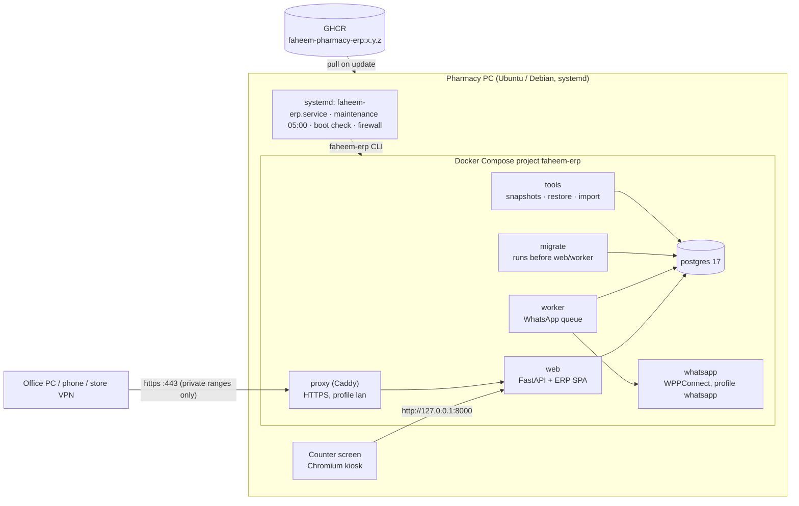

# Architecture

## The appliance

One pharmacy PC runs everything. The browser on its screen and, optionally, other devices on the
shop network or store VPN use the ERP; nothing is hosted in the cloud.

| Piece | What it is |
|---|---|
| Image | one image per release (`Dockerfile`): the app, its host tooling (`deploy/appliance`), compose files. Tagged `x.y.z` and `sha-<commit>`, never `latest`. |
| `migrate` | `python -m app.production migrate`: advisory lock, Alembic to head (a new database is created from the models and stamped), seeding, verification. `web` and `worker` start only after it succeeds. The API process never changes the schema. |
| `web` | uvicorn, one process; binds 127.0.0.1 on the host. Health: `/health/live`, `/health/ready` (database + schema). Version: `/api/v1/system/version`. |
| `worker` | `python -m app.worker`: the durable WhatsApp queue, with a heartbeat file for its health check. |
| `proxy` | Caddy with its own local CA: the only service published on the network (80/443); the host firewall admits private and VPN ranges only. |
| Host tooling | `/opt/faheem-erp/releases/<version>/` unpacked from the image; `faheem-erp` CLI, Control Center (whiptail), doctor, update/rollback/backup/restore/maintenance scripts, systemd units, kiosk launcher. |
| State | `/etc/faheem-erp/faheem.env` (secrets, 0600) · `/var/lib/faheem-erp` (database, uploads, WhatsApp session, CA) · `/var/backups/faheem-erp` · `/var/log/faheem-erp`. |

Update: pull → rehearse migrations on a scratch copy → verified snapshot → stop writers → switch →
migrate → health + smoke test → automatic rollback (restoring the snapshot if the schema moved).
See [UPDATE.md](UPDATE.md).

## The application

A FastAPI monolith with a single-page ERP workspace at `/app`.

| Layer | Location |
|---|---|
| ERP workspace (native ES modules, no bundler): shell, POS, inventory, purchases, sales, customers, reports, adjustments, settings, invoice studio | `app/static/erp/*.js`, `erp.css`, `app/templates/erp.html` |
| Login, two-step enrolment and password reset (server-rendered, ERP styling) | `app/templates/login.html`, `app/routers/auth.py` |
| JSON API and document endpoints (PDF invoices, exports, report documents) | `app/routers/*.py` |
| Domain services: sales, refunds, parking, purchasing and GST, supplier-file import (PDF geometry, OCR, column mapping), inventory ledger and pricing, units of measure, reports, WhatsApp, MFA, upgrades | `app/services/` |
| Persistence | `app/models.py`, `app/database.py`, `alembic/versions/` |
| Snapshots, SQLite → PostgreSQL import, production gates, system endpoints | `app/snapshot.py`, `app/import_sqlite.py`, `app/production.py`, `app/system.py` |
| Cross-cutting: sessions, permissions, audit trail, configuration | `app/security.py`, `app/deps.py`, `app/permissions.py`, `app/audit.py`, `app/config.py` |

### Database

- **PostgreSQL 17** in production; **SQLite** for development and the test suite, which runs on both.
- SQLAlchemy 2.0 typed models; money as `Numeric`; product search via tsvector + pg_trgm
  (FTS5 on SQLite); integrity rules as triggers / check constraints on both engines.
- Alembic migrations are additive and never recalculate history ([migration policy](UPGRADES.md)).

### Authentication and permissions

- bcrypt passwords; signed session cookies (`Secure` over HTTPS); ended sessions rejected server-side.
- Two-step sign-in (TOTP, RFC 6238) set up at first login; recovery codes stored as hashes; secrets
  sealed with the installation key; lock-out after 5 failures. Sign-ins arriving through the network
  proxy always need the code.
- Role-based permissions guard every route; WhatsApp, settings and system information are
  administrator-only.

### Data conventions

- Timestamps in UTC; business dates and periods in the pharmacy's time zone.
- Stock changes only through the inventory ledger, in base units; documents are immutable and
  corrected by linked documents; sale lines keep their cost so past profit never changes.

### Supplier invoices

Deterministic: native PDF tables rebuilt from word positions, Tesseract OCR for scans, columns
understood from headers and values (learned per supplier), validated against the bill's own totals;
unproven lines go to review instead of being guessed.
