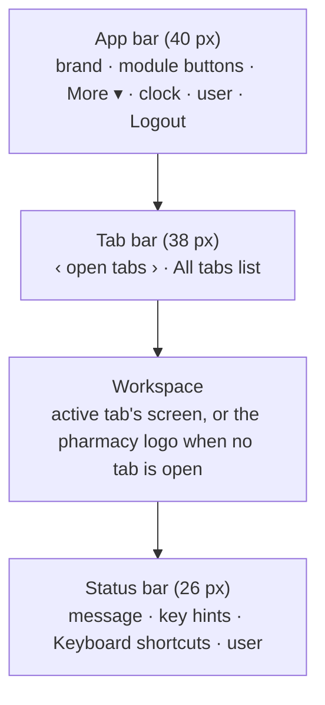
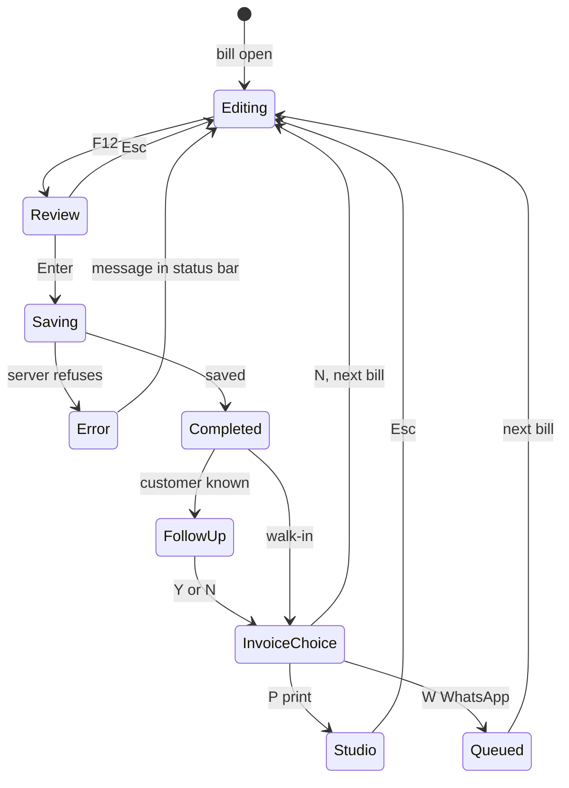

# Design system and user experience

**Reviewed:** 2026-10-06 against `app/static/erp/erp.css` and the screens in `app/static/erp/`. Product context:
[PRD.md](PRD.md); technical structure: [ARCHITECTURE.md](ARCHITECTURE.md).

---

## 1. Design philosophy

| Principle | What it means in the product | Where to see it |
|---|---|---|
| **Keyboard first** | Every action has a key shown on screen (`<kbd>` badges); the mouse is optional. Enter confirms, Esc goes back, F-keys act. | `keymap_service.py`, status-bar key hints |
| **Dense, desktop-class** | Compact 13 px text and 30 px table rows, so a counter screen shows many lines without scrolling | `--row: 30px` in `erp.css` |
| **One workspace, many tabs** | Modules open as tabs that keep their state; several bills at once (Alt+N) | `shell.js` |
| **Never a pop-up window** | Invoices, dialogs and summaries open inside the tab; other tabs stay usable | `studio.js`, `pos.js` overlays |
| **Say what happened** | Every action ends with a message in the status bar: green done, amber attention, red error | `#st-msg` in `erp.html` |
| **Money not received stands out** | Udhaar (pay later) is amber everywhere *(1.10.0)* | `.pm-udhaar`, `.done-banner.udhaar` |
| **Calm, not decorative** | Neutral greys, one green accent, no animations, no explanatory clutter | `:root` tokens |

**Target environment:** a counter PC with a 1366×768 or larger screen, keyboard and barcode scanner, running
Chromium in kiosk mode. Other PCs and phones on the shop network use the same screens in a browser; narrow screens
are supported for viewing (see [§8](#8-responsive-behaviour)), but the product is designed for desktop counters.

---

## 2. Layout architecture

*In words:* four horizontal bands (CSS grid on `body`: `40px 38px 1fr 26px`). The middle band holds one screen per
open tab; hidden tabs keep their state.

| Part | Behaviour | Source |
|---|---|---|
| App bar | Module buttons for the modules the user may open; what does not fit goes into **More ▾** | `shell.js` `fitModules`, `.appbar` |
| Tab bar | Tabs with title, unsaved dot (•) and close ×; scroll arrows; list of all tabs; Alt+Z tab switcher | `shell.js`, `.wtab` |
| Screens | Usually *filters bar* on top, then a *list* (grid) with a *detail pane* on the right; panes resizable by dragging the divider | e.g. `sales.js`, `inventory.js` |
| Modals | Centred dialog, Enter saves, Esc cancels, Tab cycles inside the dialog | `core.js` `modal()` |
| Overlays | Panels over one tab only (POS sale summary, completion banner) | `pos.js` `showOverlay` |
| Context menus | Right-click on a grid row: the row's actions with their keys | `grid.js`, `.ctx-menu` |
| Command palette | Ctrl+K: type a command name | `shell.js`, `.palette` |
| Quick lookup | Ctrl+F: product stock and location from anywhere | `shell.js` |
| Empty workspace | The pharmacy logo (`static/brand/svg/full-stacked-color.svg`) *(1.10.0)* | `.workspace:empty` |

---

## 3. Design tokens

Defined once on `:root` in `app/static/erp/erp.css`.

### Colours

| Token | Value | Use |
|---|---|---|
| `--bar` / `--bar-2` | `#1f2a30` / `#2b383f` | App bar background / active module |
| `--bar-text` / `--bar-muted` | `#dfe7ea` / `#93a4ab` | App bar text |
| `--bg` | `#eef1f2` | Page background |
| `--surface` | `#fff` | Panels, grids |
| `--head` | `#f4f6f7` | Table headers, filter bars |
| `--line` / `--line-2` | `#d5dcdf` / `#e6eaec` | Borders, row dividers |
| `--text` / `--muted` | `#1b2327` / `#5f6d73` | Text / secondary text |
| `--accent` / `--accent-2` | `#1f6f4a` / `#e6f3ec` | Primary buttons, active states / light accent fill |
| `--sel` | `#e3f1e8` | Selected row |
| `--focus` | `#2f7ae5` | Keyboard focus outline |
| `--ok` | `#1f6f4a` | Success |
| `--warn` / `--warn-bg` | `#9a6400` / `#fff4dc` | Attention |
| `--bad` / `--bad-bg` | `#b3261e` / `#fdecea` | Errors, destructive buttons |
| Udhaar amber *(1.10.0, not a token)* | borders `#d39b20` / `#d97706`, fill `#fff8e6`, text `#7a4d00` | Money not received |

### Typography

| Use | Value |
|---|---|
| Base | 13 px / 1.35, `"Segoe UI", system-ui, -apple-system, Roboto, Arial, sans-serif` |
| Numbers, codes, batches | `--mono`: `ui-monospace, "Cascadia Mono", Consolas, "Roboto Mono", monospace` (12.5 px) |
| Table headers | 12 px, weight 600 |
| Hints | 12 px, muted colour |
| Key badges (`kbd`) | 10.5 px monospace, weight 600 |
| Login page / brand | Inter and Manrope, bundled in `app/static/fonts/` (`app/static/brand.css`) |

### Size, spacing and shape

| Token | Value |
|---|---|
| `--row` | 30 px (grid row height) |
| `--r` | 3 px (default border radius) |
| Buttons | 30 px high, 12 px side padding |
| Filter bar | 10 px gaps, labels above fields (11.5 px) |
| Shadows | Only on floating layers (dropdowns, modals, menus, tips), e.g. `0 10px 28px rgba(0,0,0,.18)` |
| Breakpoints | 1400 px, 1100 px, 1000 px, 900 px, 600 px (see [§8](#8-responsive-behaviour)) |

---

## 4. Components

| Component | Purpose | Used in | Source |
|---|---|---|---|
| **Grid** | Keyboard table: ↑↓ select, Enter activate, right-click menu, resizable columns (widths remembered), multi-mark for bulk actions, load-more on scroll, empty message | Inventory, Sales, Purchases, Udhaar, Manual Bills, Customers, Racks | `grid.js` |
| **Modal** | Form dialog with error line and submit / cancel; focus trapped | Returns, receive payment, void, settings | `core.js` `modal()` |
| **Invoice Studio** | Invoice preview in a frame: A4, A5, Letter, 80 mm, 58 mm, ERP text; expiry and black-and-white toggles; print, PDF, Excel, CSV | POS (after sale), Sales, Manual Bills | `studio.js` |
| **Search dropdown** | Results table under the item box, ↑↓ / Enter / click | POS item and customer search | `pos.js` |
| **Status bar message** | One-line result of the last action, coloured by kind; clears after 7 s unless it is an error | Everywhere | `shell.js` `status()` |
| **Key badge** (`kbd`) | Shows the shortcut on a button; updates when the user reassigns it | Everywhere | `data-shortcut` + `keys.js` |
| **Tag / document state** | Small labels: `manual`, `VOIDED`, `UDHAAR OWED`, `M` (manual batch) | Grids, detail panes | `.tag`, `.doc-st` |
| **Completion banner** | Large message after a sale: green *SALE COMPLETED — CASH — ₹850 PAID*, amber *… OUTSTANDING — DUE …*, grey for manual bills *(1.10.0)* | POS | `pos.js` `doneBanner`, `.done-banner` |
| **Totals bar** | Pinned totals under a list: items, quantity, rate value, MRP value *(1.10.0)* | Inventory, Current / Batch-wise Stock reports | `.inv-totals`, `.report-totals-bar` |
| **Cards** | Figure tiles that open the bills behind them | Counter Report, Udhaar detail *(1.10.0)* | `.c-card`, `.ud-cards` |
| **Follow-up popover** | Create a follow-up next to the anchor | POS, Customers | `followup.js` |
| **WhatsApp panel** | Delivery history and send / resend | Sales, POS | `whatsapp.js` |
| **Location picker / chip** | Rack and box display and move | Inventory, POS, Purchases | `locations.js` |

---

## 5. Forms

| Behaviour | Rule |
|---|---|
| Field movement | Enter moves to the next field or submits; Tab moves; Esc cancels and returns focus to where it was |
| Validation | Checked on screen as you type where it helps (quantities, discounts, Udhaar dates), and **always again on the server**; the server's message is the one that counts |
| Errors | In a modal: the red line above the buttons (`.modal-error`); in a screen: the status bar and a red outline on the field (`.bad`) |
| Required fields | Marked by the action failing with a specific message (e.g. *"Enter the reason for voiding the bill"*); HTML `required` on key inputs |
| Submission | Buttons are disabled while saving (e.g. POS `busy`); duplicate submissions are harmless (request ids) |
| Refused input | A refused bill discount goes back to the last valid value with a message |

---

## 6. Tables

| Feature | How |
|---|---|
| Filtering | Filter bar above each list (search, dates, status, category, supplier, rack…); filters are sent to the server |
| Sorting | A *Sort* filter where offered (e.g. Inventory: name, rack, category, stock); column headers do not sort |
| Paging | Lists load 200 rows and fetch more when you scroll near the end |
| Selection | One selected row (↑↓); the detail pane follows it |
| Bulk actions | Mark rows (multi-select grids, e.g. Inventory) → bulk bar (enable / disable, category, move to rack) |
| Columns | Resizable; Inventory and Reports have a column chooser; widths remembered per user browser |
| Drill-down | Enter / double-click opens the document (bill in Sales, product in Inventory) |
| Totals | Report footers; pinned totals bar for stock lists *(1.10.0)* |

---

## 7. Accessibility

**Existing**
- Visible keyboard focus everywhere (`:focus-visible` outline in `--focus` blue).
- Landmarks and labels: module navigation, tab list (`role="tablist"`), grids (`role="grid"` with labels), dialogs (`role="dialog"`, `aria-modal`), command list (`role="listbox"`).
- Status messages are announced (`#st-msg` `role="status" aria-live="polite"`).
- Focus is trapped in dialogs and returned afterwards.
- Every action is reachable without a mouse.

**Improvements (Recommendation)**
- Colour carries meaning (green / amber / red); keep the words too (they are present today in banners and statuses), and check contrast of amber text on amber fill.
- Grid cells are plain table cells; screen-reader row/column announcements are not confirmed.
- Text size is fixed at 13 px; browser zoom works, but no in-app size setting exists.

---

## 8. Responsive behaviour

| Width | Change |
|---|---|
| ≤ 1400 px | Tighter spacing in the app bar; modules overflow to **More ▾** |
| ≤ 1100 px | Detail panes move under the list (Sales, purchase review); some POS columns (code, pack) are hidden before the rack column |
| ≤ 1000 px | Racks split panes stack |
| ≤ 900 px | Clock hidden; tighter module buttons |
| ≤ 600 px | Narrower brand and tabs; inventory column groups in one column |

There is no separate mobile layout.

---

## 9. UI state model

| State | How it looks |
|---|---|
| Loading | Short text in place (*"Loading…"*, *"Rendering…"*, *"Checking what the customer owes…"*); no spinners |
| Empty | Grid message (*"No bills in this period."*, *"Nothing owed here."*); logo when no tab is open |
| Success | Green status message (`.st-msg.ok`); green completion banner |
| Warning | Amber status message (`.st-msg.warn`); amber row or cell (`ps-warn`); Udhaar amber |
| Error | Red status message (stays until the next action); red field outline; modal error line |
| Disabled | Buttons at 55 % opacity (`.btn:disabled`); hidden when the user lacks the permission |
| Unsaved | Dot (•) on the tab; closing a POS tab with a bill asks to hold or discard; the browser warns before leaving the page with unsaved work |

*In words:* the POS moves from editing a bill to a read-only summary (F12), then to saving. A server refusal brings
the cashier back to the bill with the reason. After saving, the banner shows how it was paid; the cashier chooses
follow-up (for known customers) and the invoice output, then starts the next bill.
