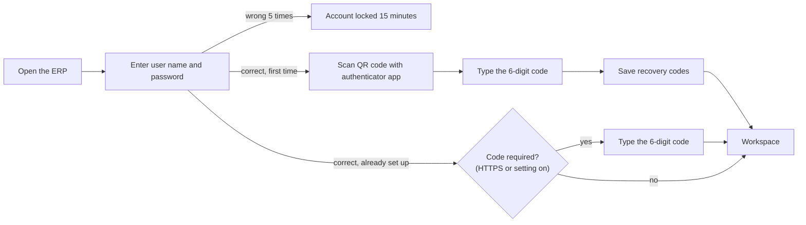
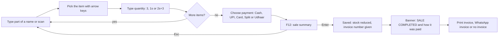
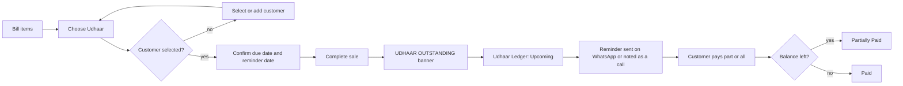
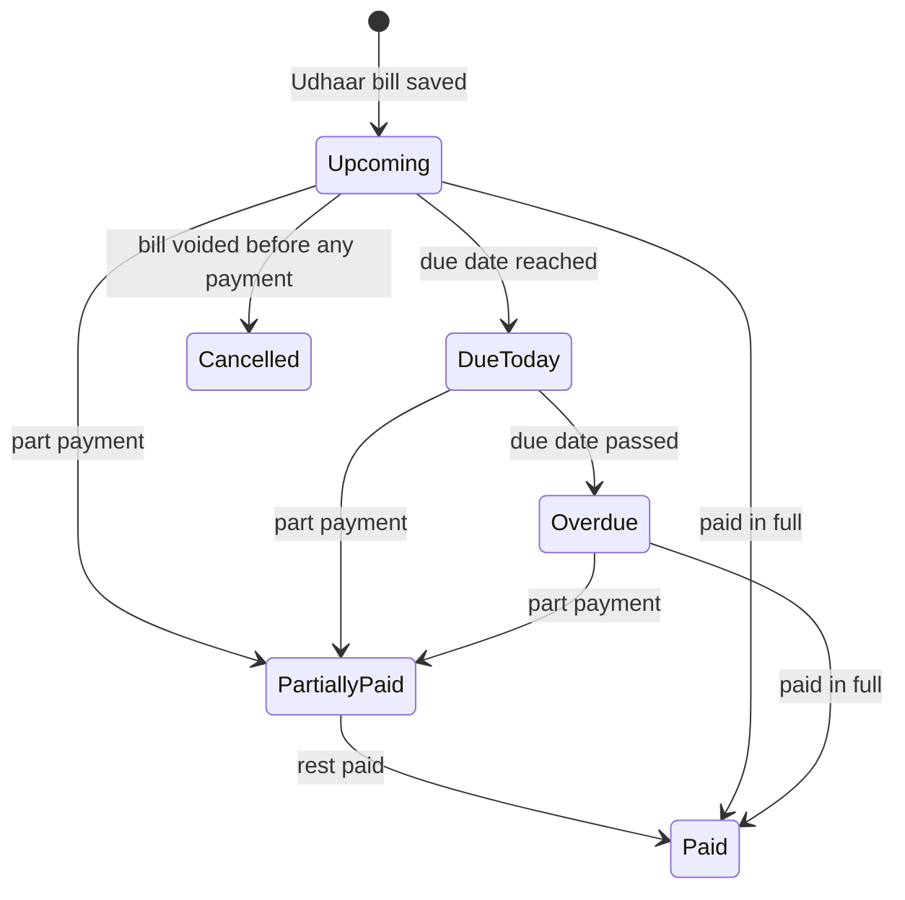
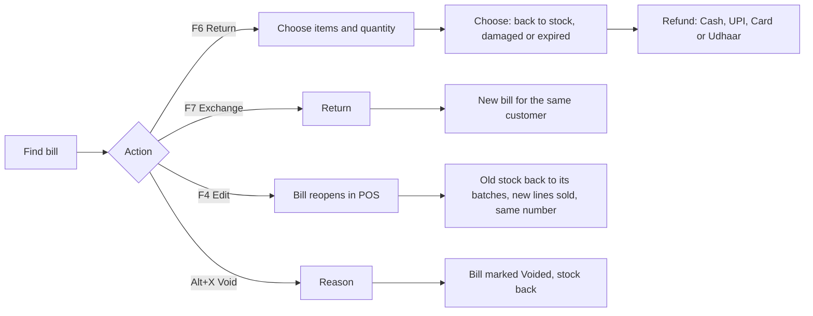
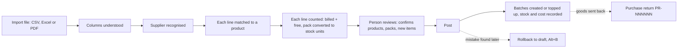
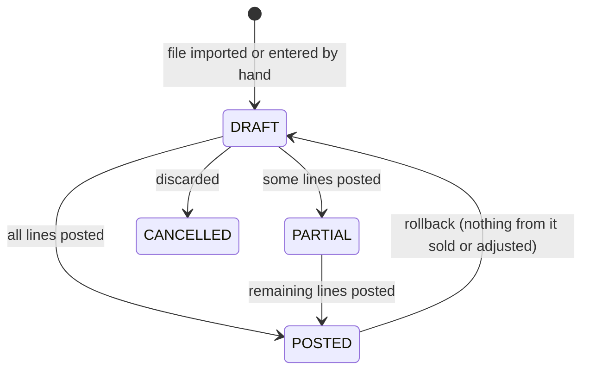
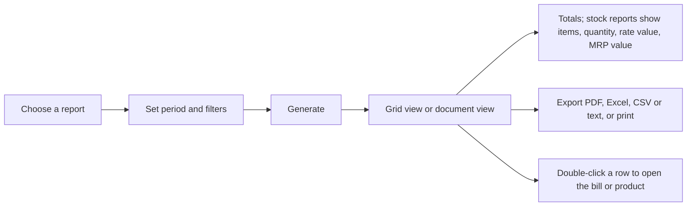
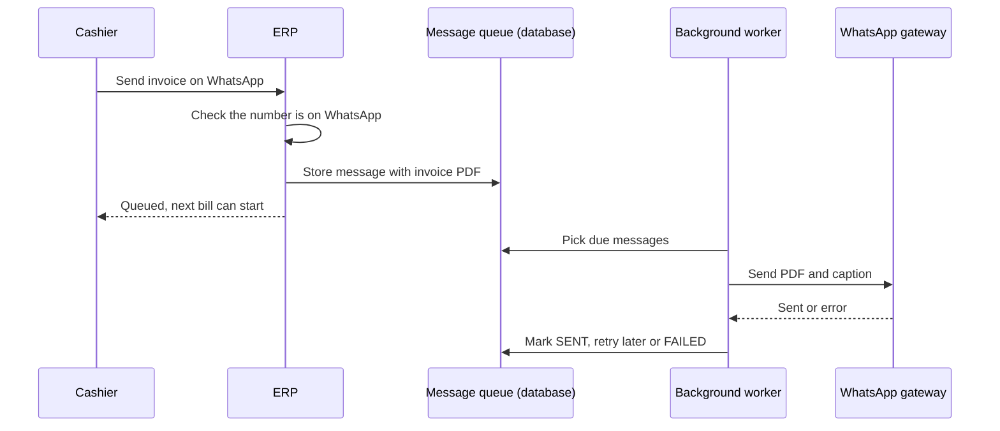

# Product Requirements Document (PRD)

**Product:** Faheem Pharmacy ERP · **Released version:** 1.9.2 · **In development:** 1.10.0 · **Reviewed:** 2026-10-06

A PRD (Product Requirements Document) explains **what** a product is and **why** it exists, in business language.
How it is built is in [ARCHITECTURE.md](ARCHITECTURE.md); the exact rules are in [RULES.md](RULES.md).

> **Reading the status labels.** *Implemented* = in the released version and confirmed in the code.
> *Implemented — unreleased* = finished and tested in the development branch, not yet on the pharmacy PC.
> *Partial* = some of it exists. *Not supported* = the code does not do it.

---

## 1. Product overview

### Purpose
Faheem Pharmacy ERP runs a retail pharmacy's daily work in one keyboard-driven system: selling at the counter,
receiving stock from suppliers, keeping stock right by batch and expiry, following up with customers, and reporting
on all of it. It was built for one pharmacy (Faheem Pharmacy, Hyderabad) and installed on the shop's own PC.

### The problem
A pharmacy counter has to be fast and must never get a sale wrong. Common failures this product is built to prevent:

- selling a batch that has **expired**, or stock that is **not on the shelf**;
- **wrong prices**, or discounts beyond what the owner allows;
- stock and cost that drift away from reality because supplier invoices were typed in by hand;
- **no record** of who changed a bill, a price or a stock figure;
- losing work when the PC restarts or the power goes;
- money owed by regular customers (*Udhaar*, Hindi for "on credit") kept only in a notebook.

### Vision
One trusted system where the counter, the stock room and the books always agree. Every figure can be traced back to
the document that created it, and nothing is silently changed afterwards.

### Main goals
1. Billing that is fast and keyboard-only, and that cannot sell something it should not.
2. Stock that is exact by batch, expiry and pack size, kept in a permanent movement history (the *ledger*).
3. Supplier invoices read automatically and checked by a person before any stock changes.
4. Reports the owner can trust, built from the stored documents.
5. Safe operation in a small shop: automatic backups, guarded updates, recovery after a crash.

### Target users and personas

| Persona | Who they are | What they need |
|---|---|---|
| **Cashier / sales staff** | Sells at the counter all day | Fast billing, clear messages, no mistakes possible |
| **Pharmacist** | Sells, receives stock, manages inventory | Accurate stock by batch and expiry; supplier invoice review |
| **Counter manager** | Supervises the counter | Sales history, refunds, day totals |
| **Accountant** | Looks at numbers | Purchase, sales, GST and profit reports |
| **Owner / administrator** | Runs the business and the PC | Everything above, plus users, settings, WhatsApp, backups |
| **Support technician** | Helps remotely | Remote desktop, only when the pharmacy allows it |

Roles in the software are listed in [§4](#4-user-roles).

### Primary use cases
1. Sell medicines to a walk-in customer and print an invoice or send it on WhatsApp.
2. Sell to a regular customer who pays later (Udhaar), then record the payment when it comes.
3. Import a supplier's invoice file, review it, and post it into stock.
4. Return goods from a customer, or to a supplier.
5. Find where a product is kept, how much is left, and when it expires.
6. Close the day: check the counter total by payment mode.
7. Run reports for sales, purchases, stock, customers and profit.

---

## 2. Product scope

### Implemented (released, 1.9.2)
- Login with password and authenticator code (2FA, two-factor authentication), account lock after repeated failures, role-based permissions.
- Workspace with tabs, keyboard shortcuts (each user can change their own), command palette, quick product lookup.
- POS billing: batch chosen automatically by earliest expiry (FEFO, *First Expiry, First Out*), loose units (tablets from a strip), discounts with a store limit, Cash / UPI (India's instant bank-transfer payment) / Card / Split, hold and resume, inline customer creation, Walk-in / Home delivery.
- Sales history: search, returns and refunds, exchange, bill edit, void, invoice studio (A4, A5, Letter, 80 mm, 58 mm, plain text), PDF / Excel / CSV export.
- Inventory: products, packaging and units, batches, disable / enable / recycle bin, opening-stock import from a sheet, export.
- Purchases: supplier invoice import (CSV, Excel, text PDF), automatic supplier and product recognition, counting of every line, review, posting into stock, partial posting, rollback to draft, purchase returns, GST (Goods and Services Tax) on purchases.
- Stock history and numbered stock adjustments with reversal.
- Racks and boxes: product locations with full history and as-of reports.
- Customers: directory, invoices, activity, follow-ups (inbox and calendar).
- Reports: 34 reports with column choice and PDF / Excel / CSV / text export.
- WhatsApp invoices (customer-requested), invoice templates, pharmacy logo and payment QR code on invoices.
- Two counters at once with live refresh (changes from one PC appear on the other within 3–4 seconds).
- Crash safety: open tabs and unfinished bills are saved continuously and restored at the next login.
- Appliance: installer, automatic start, daily 05:00 maintenance, backups, guarded updates with rollback, health checks.

### Implemented — unreleased (development branch, 1.10.0)
- **Udhaar** payment mode and **Udhaar Ledger** (repayments, statuses, reminders, statements).
- **Counter Report** per business day, frozen at midnight.
- **Manual bills** as separate documents, kept out of sales, reports, cash, Udhaar and stock.
- Sale-completed banner showing the payment status.
- Totals footer (items, quantity, rate value, MRP value — MRP is the Maximum Retail Price) on Inventory and stock reports.
- Pharmacy logo when no tab is open.
- POS fix: Enter adds the item picked with the arrow keys.

### Partial
| Area | What exists | What is missing |
|---|---|---|
| Remote support | Package, server kit and commands are in the code (`deploy/support/`, `deploy/support-server/`) | Not active until the support server is set up and the PC enrolled ([ONSITE-PENDING.md](ONSITE-PENDING.md)) |
| Scanned invoice import (photos / image PDFs) | OCR code exists (`app/services/ocr.py`) | Switched off by default (`purchase_scan_import=off`) |
| Automatic product creation from invoices | Code exists | Off by default (`purchase_auto_create_products=off`); new products wait in a confirmation queue |
| AI invoice reader | Optional module (`app/services/invoice_agent.py`) | Off by default; needs an API key in settings |
| Idle screen / workspace lock | Settings `idle_timeout_minutes` and `lock_timeout_minutes` exist | Not confirmed from the current codebase that the screen uses them (see [TASKS.md](TASKS.md)) |

### Not supported
- Online / internet-facing use (designed for the shop network; see [ARCHITECTURE.md](ARCHITECTURE.md#18-security-architecture)).
- GST on sales invoices (sale prices are MRP-inclusive; GST is handled on **purchases**).
- Multiple branches / multiple stores in one database.
- Mobile app (the web screens can be used in a phone browser on the shop network).
- Bulk or promotional WhatsApp messages (only customer-requested invoices and Udhaar reminders).
- Online payments collection; UPI and card are recorded, not processed.

---

## 3. Core features

Each feature below lists who uses it, why it exists, the workflow, its restrictions, the data involved and the result.

### 3.1 Sign-in and session

| | |
|---|---|
| **Who** | Every user |
| **Why** | Only staff may use the system; every action is recorded under a named person |
| **Restrictions** | 5 wrong passwords lock the account for 15 minutes. First login requires setting up an authenticator app. A session lasts at most 12 hours. |
| **Data** | `users`, `login_sessions`, `audit_logs` |
| **Code** | `app/routers/auth.py`, `app/security.py`, `app/services/mfa.py` |

*In words:* a password is always needed. The authenticator is set up on the first login. After that, the
6-digit code is asked whenever the ERP is opened over the network (HTTPS) or when the owner turns it on for every login.

### 3.2 POS billing

| | |
|---|---|
| **Who** | Cashier, pharmacist, counter manager |
| **Why** | Sell quickly without mistakes |
| **Restrictions** | Expired batches and missing stock cannot be sold; quantity must fit the pack (a product not sold loose is sold in whole packs); item and bill discounts together stay within the store limit (`max_discount_pct`, default 20%); disabled products cannot be sold |
| **Data** | `sales`, `sale_items`, `sale_payments`, `inventory_movements`, `batches`, `customers` |
| **Result** | A numbered invoice (`INV-YYYYMMDD-NNNN`), stock reduced batch by batch, optional printed / WhatsApp invoice |
| **Code** | `app/static/erp/pos.js`, `app/routers/sales.py`, `app/services/sales_service.py`, `app/services/stock_ledger.py` |

*In words:* the cashier never leaves the keyboard. The system picks the batch that expires first and charges that
batch's MRP (Maximum Retail Price). The bill is checked again on the server before it is saved.

Hold (Ctrl+H) parks an unfinished bill; Resume (Ctrl+R) brings it back on any counter. Alt+N opens another bill in a new tab.

### 3.3 Udhaar — pay later *(Implemented — unreleased, 1.10.0)*

| | |
|---|---|
| **Who** | Cashier gives Udhaar; staff with `udhaar.receive` record payments and reminders; owner sets limits |
| **Why** | Regular customers pay later; the shop must know exactly who owes what and when |
| **Restrictions** | A customer with a mobile number is required; a due date and a reminder date are required; the customer's Udhaar limit (if set) cannot be exceeded; a manual bill can never be Udhaar |
| **Data** | `udhaar_entries` (what is owed per bill), `udhaar_payments` (money received / goods returned), `udhaar_reminders` |
| **Result** | The bill is saved with an Udhaar part; the Udhaar Ledger shows it until it is paid |
| **Code** | `app/services/udhaar_service.py`, `app/routers/udhaar.py`, `app/static/erp/udhaar.js` |

*In words:* the status is worked out from the dates and the payments. A payment never changes the original bill; it
is added to the ledger. Example: a ₹2,000 Udhaar bill with ₹500 received shows ₹1,500 owed.

### 3.4 Sales history, returns, edits and voids

| | |
|---|---|
| **Who** | Counter manager (all bills), cashier (own bills), owner |
| **Restrictions** | A return is its own document (`RFND-…`), never an edit of the bill; refunds above `refund_manager_threshold` (default ₹1,000) or to a different payment method need `sales.refund_override`; a bill with returns, or with Udhaar payments received, cannot be edited; voiding needs a reason; an unpaid Udhaar bill can only be refunded by reducing what is owed |
| **Code** | `app/static/erp/sales.js`, `app/routers/sales_history.py`, `app/services/refund_service.py` |

### 3.5 Counter Report *(Implemented — unreleased, 1.10.0)*

| | |
|---|---|
| **Who** | Pharmacist, counter manager, accountant, owner (`reports.counter`) |
| **Why** | Check the day's money by payment mode and match the cash drawer |
| **Rules** | A business day is the store's calendar day, ending at 11:59 PM store time. At midnight the day's figures are frozen with a tamper-evident fingerprint (SHA-256 digest). Later edits to that day are shown next to the frozen figures, never instead of them. |
| **Output** | Per mode (Cash, UPI / Online, Card, Udhaar): bills, sales, Udhaar collected, refunds, received. Plus gross, discounts, returns, net, cash in hand, Udhaar given / collected / outstanding, voided bills. Click any figure to see the bills behind it. |
| **Code** | `app/services/counter_service.py`, `app/static/erp/counter.js` |

### 3.6 Manual bills *(Implemented — unreleased, 1.10.0)*

A manual bill records typed items that are not in stock, for reference only. It has its own number series
(`MB-YYYYMMDD-NNNN`), its own table and its own screen. It is **never** a sale: never in Sales History, reports,
the Counter Report, cash, Udhaar, customer balances or stock. It can be printed, edited and deleted (kept, marked Deleted).
Code: `app/services/manual_bill_service.py`, `app/static/erp/manualbills.js`.

### 3.7 Purchases (supplier invoices)

| | |
|---|---|
| **Who** | Pharmacist, owner (`purchase.create`, `purchase.post`) |
| **Why** | Stock and cost must come from the real supplier invoice, without retyping it |
| **Restrictions** | The same file cannot be imported twice; the same supplier invoice number can be received only once; nothing enters stock until a person posts it; fuzzy product matches are only suggestions; scanned images are off by default; new products are not created automatically by default |
| **Data** | `purchases`, `purchase_items`, `suppliers`, `supplier_product_maps`, `product_packagings`, `batches`, `inventory_movements` |
| **Result** | Posted purchase `PUR-NNNNNN`, batches with cost (GST included by default) and MRP, stock increased |
| **Code** | `app/services/purchasing.py`, `purchase_automation.py`, `purchase_import.py`, `column_mapper.py`, `product_matcher.py`, `receipt_proposer.py`; screens `purchases.js`, `purchase.js` |

*In words:* the system does the reading and the arithmetic; a person confirms before stock changes. What a person
teaches it (a supplier's product code, a pack size) is remembered for next time.

### 3.8 Inventory and stock adjustments

| | |
|---|---|
| **Who** | Pharmacist, owner |
| **What** | Product master (name, code, category, form, pack, units, reorder level, rack), batches (number, expiry, MRP, purchase rate, stock), filters, import of opening stock, Excel export, and the Inventory totals footer *(1.10.0)* |
| **Adjustments** | Numbered documents: OUT — loose / missing, damage, expired, count shortfall, other; IN — count surplus, other. Each can be reversed by another document; nothing is deleted. |
| **Code** | `app/static/erp/inventory.js`, `app/routers/erp.py`, `app/services/inventory_service.py`, `app/services/adjustment_service.py` |

### 3.9 Customers and follow-ups
Directory with search, each customer's bills, returns and activity, notes, and follow-ups (refill, availability,
repeat purchase, payment query…) shown in an Inbox (overdue / today / upcoming) and a Calendar. A follow-up can be
created straight after a sale. Code: `app/static/erp/customers.js`, `app/routers/customers.py`, `app/services/followup_service.py`.

### 3.10 Racks and boxes
Every product can be assigned to a rack and box. Moves are recorded as events, so the location of any product on any
past date can be reconstructed. Locations never change stock. Code: `app/services/location_service.py`,
`app/static/erp/racks.js`. Details: [LOCATIONS.md](LOCATIONS.md).

### 3.11 Reports

34 reports in five groups: Sales, Purchase, Inventory, Customer, Financial / Control. Cost and profit columns appear
only for users with `reports.financials`. Code: `app/services/report_generator.py`, `report_extra.py`, `location_report.py`,
`report_document.py`; screen `app/static/erp/reports.js`.

### 3.12 Administration and settings
- **Users and roles:** via the command line (`scripts/manage.py user …`, on the appliance `sudo faheem-erp user …`).
- **Settings screen** (administrators): WhatsApp pairing, invoice message and image, invoice templates (Invoice Store), system information.
- **Store settings** (pharmacy details, discount limit, rounding, expiry warning days, Udhaar days…): `scripts/manage.py setting …`.
- **Keyboard shortcuts:** each user can change their own (Ctrl+/).

### 3.13 WhatsApp
Customer-requested invoices only. The invoice is queued and delivered in the background, so billing never waits.
Failures retry (after 30 s, then 2 min) and then show as failed with the reason. In 1.10.0, Udhaar reminders and statements are sent the same way.
Details: [WHATSAPP.md](WHATSAPP.md).

### 3.14 Background and automatic processing
| Automation | When | Code |
|---|---|---|
| WhatsApp delivery queue | Continuously | `app/worker.py`, `app/services/whatsapp/service.py` |
| Counter day close, automatic Udhaar reminders (if switched on) | Every few minutes (1.10.0) | `app/main.py` (`_whatsapp_worker`), `counter_service`, `udhaar_service` |
| Live refresh between counters | Every 4 seconds | `app/static/erp/shell.js`, `app/services/sync_service.py` |
| Workspace save (tabs, unfinished bills) | Continuously | `app/routers/workspace.py` |
| Daily maintenance (backup, health, reboot) | 05:00 store time | `deploy/appliance/systemd/faheem-erp-maintenance.timer` |
| Snapshots during development use | Periodically and at shutdown (SQLite) | `app/main.py`, `app/snapshot.py` |

### 3.15 Import and export
| Import | Export |
|---|---|
| Supplier invoices (CSV, XLS / XLSX, text PDF) | Reports: PDF, Excel, CSV, text |
| Opening stock sheet (CSV / Excel) | Inventory: Excel (also the re-import template) |
| Medicine reference catalogue (Excel) | Single invoice: PDF, Excel, CSV |
| Old SQLite database into PostgreSQL (`app/import_sqlite.py`) | Udhaar statement: print / WhatsApp text (1.10.0) |

---

## 4. User roles

Roles are templates of permission codes (`app/permissions.py`, `DEFAULT_ROLES`). An administrator can change them;
new permissions are given to roles automatically when they are introduced (`app/seed.py`).

| Role | Purpose | Access (summary) |
|---|---|---|
| **Administrator** | Owner / system administrator | Everything, including Settings (`settings.manage`) |
| **Manager** | Operational manager | Everything except Settings |
| **Pharmacist** | Dispensing and stock | POS, sales history, discounts, refunds, inventory (view/create/edit/export), purchases (import, post, return, suppliers), customers and follow-ups, sales / expiry reports, adjustments, racks (assign, move, history, reports), Udhaar (view, receive, manage), Counter Report |
| **Counter Manager** | Billing supervisor | POS, all sales history, discounts, refunds, customers and follow-ups, rack view, Udhaar (view, receive), Counter Report |
| **Sales Staff** | Cashier | POS, own sales only, discounts, refunds, customers and follow-ups, rack view, Udhaar (view, receive) |
| **Accountant** | Financial reporting | Purchases (view, return, suppliers), all reports incl. financial and export, sales history, profit, inventory view/export, rack reports, Udhaar view, Counter Report |

The full permission list (49 codes) is in [RULES.md](RULES.md#3-user-permission-rules).

---

## 5. Functional requirements

Requirements as implemented. *(U)* = implemented — unreleased (1.10.0).

| ID | Requirement | Where |
|---|---|---|
| FR-001 | Users sign in with user name and password; a TOTP authenticator code is enrolled at first login | `app/routers/auth.py` |
| FR-002 | Five failed logins lock the account for 15 minutes | `app/routers/auth.py` (`MAX_FAILURES, LOCK_MINUTES`) |
| FR-003 | Every API call checks a permission code of the user's role | `app/deps.py` `require_permission` |
| FR-004 | A sale allocates stock from unexpired batches, earliest expiry first, unless the cashier picks a batch | `app/services/stock_ledger.py` |
| FR-005 | Each batch line is charged that batch's MRP; prices never come from the browser | `app/services/sales_service.py` `_add_lines` |
| FR-006 | Item and bill discounts are percentages capped by `max_discount_pct`, also in total | `sales_service._line_discount`, `_apply_totals_and_payments` |
| FR-007 | Payments must add up exactly to the bill; cash tendered below the cash part is refused | `sales_service._normalize_payments` |
| FR-008 | A retried sale submission with the same request id returns the same bill (no double billing) | `sales_service.create_sale` (`client_request_id`) |
| FR-009 | Bills can be held and resumed on any counter; one counter wins a resume | `app/services/parking_service.py` |
| FR-010 | A completed bill can be edited (same number) unless voided, returned or with Udhaar repayments | `sales_service.amend_sale`, `editable_problem` |
| FR-011 | Voiding needs a reason and puts stock back with reversing movements | `sales_service.void_sale` |
| FR-012 | Returns are separate documents; refund rules depend on amount, method and permission | `app/services/refund_service.py` |
| FR-013 | A supplier invoice file is imported once (file fingerprint); an invoice number is received once per supplier | `purchasing.py`, `models.Purchase` index |
| FR-014 | Purchase lines are matched and counted automatically; only a person posts them into stock | `purchase_automation.py`, `purchasing.post` |
| FR-015 | A posted purchase can be rolled back to draft only if none of its stock has moved since | `purchasing.rollback` |
| FR-016 | Every stock change is a ledger movement; batch stock always equals the sum of its movements | `app/services/stock_ledger.py` (`reconcile`) |
| FR-017 | Stock adjustments are numbered documents and reversed only by another document | `app/services/adjustment_service.py` |
| FR-018 | Product locations are dated events; past locations are reconstructed | `app/services/location_service.py` |
| FR-019 | Reports are generated from stored documents, exportable to PDF / Excel / CSV / text | `report_generator.py`, `report_document.py` |
| FR-020 | WhatsApp invoices are queued, retried twice, and recorded with their outcome | `app/services/whatsapp/service.py` |
| FR-021 | Open tabs and unfinished bills are saved continuously and restored after a crash | `app/routers/workspace.py` |
| FR-022 | Two PCs see each other's changes within seconds | `app/services/sync_service.py`, `shell.js` |
| FR-023 | Every data change writes an audit record (who, when, before / after) | `app/audit.py` |
| FR-024 *(U)* | Udhaar needs a customer with mobile, a due date and a reminder date; limits are enforced | `udhaar_service.sync_sale` |
| FR-025 *(U)* | Udhaar repayments are separate records; part payments leave the rest owed | `udhaar_service.receive_payment` |
| FR-026 *(U)* | An unpaid Udhaar bill is refunded only by reducing what is owed (no override) | `refund_service.create_return` |
| FR-027 *(U)* | A finished business day's Counter Report is frozen with a digest; later changes are shown as differences | `counter_service.close_day`, `report` |
| FR-028 *(U)* | Manual bills are stored apart from sales and never affect stock, sales or money figures | `manual_bill_service.py`, migration `a8c0e2f4b6d8` |
| FR-029 *(U)* | Stock totals (items, quantity, rate value, MRP value) are computed batch by batch for the filtered rows | `routers/erp.py` `_stock_totals`, `report_generator.generate` |

---

## 6. Non-functional requirements

| Area | Confirmed in the code | Source |
|---|---|---|
| **Performance** | Request work runs off the event loop so one slow request does not freeze other screens; product search uses a full-text index (SQLite FTS5; an equivalent prefix index on PostgreSQL) | `app/routing.py`, `app/database.py` (`ensure_fts`), `app/services/search.py` |
| | A location performance check exists for 10,000 products / 50,000 batches | `scripts/perf_locations.py` |
| **Reliability** | Startup integrity check of the database file (SQLite); continuous workspace saving; idempotent sale submission | `app/main.py`, `workspace.py`, `sales_service` |
| **Data integrity** | Ledger reconciliation; history never recalculated; migrations must keep the business-history fingerprint identical (or declare a reconciled move) | `stock_ledger.reconcile`, `upgrade_service`, [UPGRADES.md](UPGRADES.md) |
| **Security** | bcrypt passwords, signed cookies, 2FA, permission per route, account lock, encrypted 2FA secrets, non-root containers, database not published on the network | see [ARCHITECTURE.md](ARCHITECTURE.md#18-security-architecture) |
| **Usability** | Keyboard-first, every action has a shortcut, per-user key changes, status bar messages for every result | `keymap_service.py`, `shell.js` |
| **Availability** | Services restart automatically; health endpoints; boot check; daily maintenance | `compose.yaml`, `deploy/appliance/systemd/` |
| **Backup / recovery** | Verified snapshots before every update; automatic rollback on a failed update; restore commands | `app/snapshot.py`, `deploy/appliance/bin/backup.sh`, `restore.sh`, `rollback.sh` |
| **Auditability** | Audit log of every change; documents are numbered and never deleted (void, reverse, return instead) | `app/audit.py`, `models.AuditLog` |

> **Recommendation:** define target response times (e.g. POS search under 200 ms) and measure them in CI;
> they are not written down anywhere in the codebase today.
