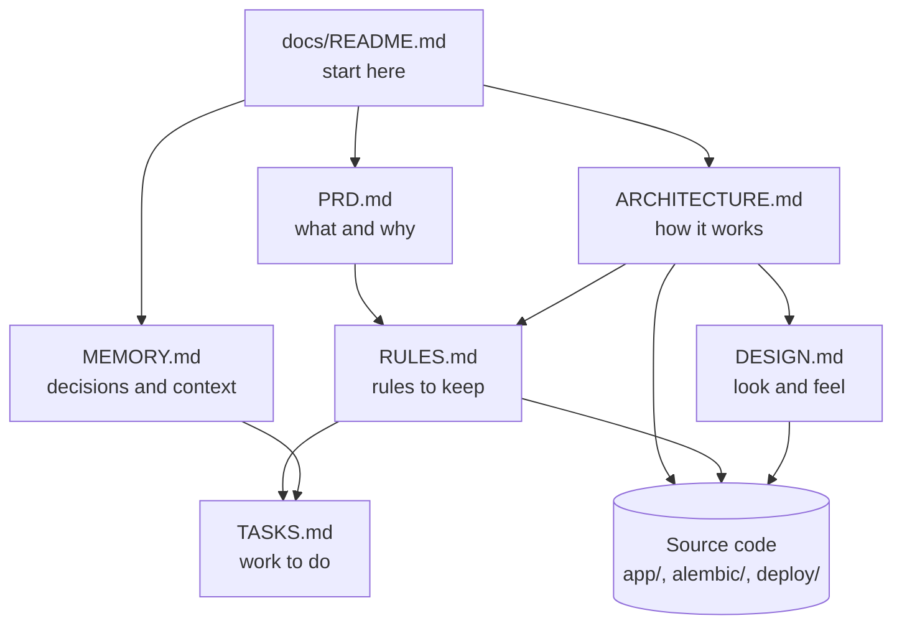

# Faheem Pharmacy ERP — Documentation

> **The source of truth for how Faheem Pharmacy ERP works.** Keep these documents up to date whenever the
> architecture, business rules, database, major features or deployment change.

Faheem Pharmacy ERP is the software a retail pharmacy uses to run its counter and its stock. **ERP** stands for
*Enterprise Resource Planning*: one system for the work that would otherwise be spread over a billing machine,
a stock register, a purchase file and a notebook of customer dues. Cashiers sell medicines with the keyboard,
stock is counted batch by batch with expiry dates, supplier invoices are imported and checked before they enter
stock, and every sale, purchase, return and correction is recorded permanently. It runs on a single computer
in the shop (the *appliance*). Other PCs and phones on the shop network can use it through a browser.

## Current status

| Item | State |
|---|---|
| Released version (pharmacy PC) | **1.9.2** (`APP_VERSION` in `app/config.py`) |
| In development (not yet released) | **1.10.0**: Udhaar ledger, Counter Report, manual bills as separate documents, stock totals, POS item-pick fix. See the "Unreleased" section of [`CHANGELOG.md`](../CHANGELOG.md) |
| Database schema (development head) | Alembic revision `a8c0e2f4b6d8` |
| Automated tests | 80 test files, 872 tests, run on SQLite and PostgreSQL 18 |
| Last documentation review | 2026-10-06 |

## What problem it solves

A busy pharmacy counter needs billing that is **fast** (keyboard only, no mouse hunting) and **correct**:
the right batch, the right price, never selling expired or missing stock. The owner needs to trust the numbers:
stock that matches the shelves, purchase costs that come from real supplier invoices, a cash total that matches
the drawer, and a record of who changed what. Faheem Pharmacy ERP enforces these rules in one place, so the
counter, the stock room and the reports always agree.

## Who should read what

| Reader | Start with |
|---|---|
| Owner, manager, new staff trainer | [PRD.md](PRD.md): what the product does and why |
| New developer | [MEMORY.md](MEMORY.md), then [ARCHITECTURE.md](ARCHITECTURE.md) and [RULES.md](RULES.md) |
| AI coding agent continuing the work | [MEMORY.md](MEMORY.md) first, always |
| Designer / front-end work | [DESIGN.md](DESIGN.md) |
| Planning the next release | [TASKS.md](TASKS.md) |

## Documentation map

| Document | Purpose |
|---|---|
| [PRD.md](PRD.md) | What the product is, who uses it, what it must do (Product Requirements Document) |
| [ARCHITECTURE.md](ARCHITECTURE.md) | How the system works technically, from the big picture to the source files |
| [RULES.md](RULES.md) | Business rules, data rules, permission rules and coding rules, with where each is enforced |
| [DESIGN.md](DESIGN.md) | The visual and interaction design: layout, colours, keyboard model, components |
| [TASKS.md](TASKS.md) | Current priorities, known issues, technical debt and future work |
| [MEMORY.md](MEMORY.md) | Project knowledge and decisions that would otherwise take days to rediscover |

Topic guides that already existed and remain valid:

| Guide | Topic |
|---|---|
| [INSTALL.md](INSTALL.md), [OPERATIONS.md](OPERATIONS.md), [UPDATE.md](UPDATE.md) | Installing and running the appliance |
| [BACKUP-RESTORE.md](BACKUP-RESTORE.md), [RECOVERY.md](RECOVERY.md), [UPGRADES.md](UPGRADES.md) | Backups, recovery and the migration policy |
| [POS.md](POS.md), [INVENTORY.md](INVENTORY.md), [PURCHASES.md](PURCHASES.md), [LOCATIONS.md](LOCATIONS.md) | Module guides |
| [WHATSAPP.md](WHATSAPP.md), [REMOTE-SUPPORT.md](REMOTE-SUPPORT.md) | Integrations |
| [HANDOFF.md](HANDOFF.md), [ONSITE-PENDING.md](ONSITE-PENDING.md) | Earlier product guide and the on-site checklist |
| [`DECISIONS.md`](../DECISIONS.md), [`DEPENDENCIES.md`](../DEPENDENCIES.md), [`CHANGELOG.md`](../CHANGELOG.md) | Decision log (D1–D30), library licences, release notes |

*How to read this:* start at this page. The PRD explains the product in business terms; the architecture explains
how it is built; both lead to the rules, which point at the exact source files that enforce them. MEMORY and
TASKS carry the history and the open work.

## The system at a glance

| Aspect | Answer | Where in code |
|---|---|---|
| Kind of application | A web application used in a browser, keyboard-first, single screen with tabs | `app/templates/erp.html`, `app/static/erp/` |
| Backend (server) | Python 3.14 with FastAPI (a web framework) | `app/main.py`, `app/routers/` |
| Business logic | Python service modules | `app/services/` |
| Database | **PostgreSQL 17** on the pharmacy appliance; **SQLite** (a single-file database) for development and tests | `app/database.py`, `compose.yaml` |
| Database changes | Alembic migrations (versioned scripts), guarded by a before/after fingerprint of business history | `alembic/versions/`, `app/services/upgrade_service.py` |
| Sign-in | Username + password (bcrypt hashed), then a 6-digit authenticator code (2FA, two-factor authentication) | `app/routers/auth.py`, `app/services/mfa.py` |
| Permissions | Role-based: each role holds a set of permission codes; every API checks one | `app/permissions.py`, `app/deps.py` |
| Deployment | Docker Compose stack on a Linux PC: database, migration job, web app, worker, optional WhatsApp gateway and HTTPS proxy | `compose.yaml`, `deploy/appliance/` |
| Integrations | WhatsApp (WPPConnect gateway, local), MeshCentral remote support (optional), optional AI invoice reader (off by default) | `app/services/whatsapp/`, `deploy/support/`, `app/services/invoice_agent.py` |

## Main modules (screens)

| Module | What it is for |
|---|---|
| POS (Point of Sale) | Billing at the counter: batches chosen automatically, discounts within the store limit, Cash / UPI / Card / Split / Udhaar |
| Sales | Every bill: search, detail, returns and refunds, exchange, edit, void, invoice printing and WhatsApp |
| Udhaar Ledger | What customers owe (pay-later sales), repayments, reminders, statements *(1.10.0, unreleased)* |
| Counter Report | One business day by payment mode, frozen at midnight *(1.10.0, unreleased)* |
| Manual Bills | Typed reference bills that are never sales and never touch stock *(1.10.0, unreleased)* |
| Inventory | Products, packaging, batches with expiry and price, stock status, import/export |
| Purchases | Supplier invoices: import (CSV, Excel, PDF), automatic matching and counting, review, post into stock, returns |
| Stock History / Adjustments | Every stock movement, and numbered stock corrections (damage, loss, count) |
| Customers | Customer directory, bills, follow-up inbox and calendar |
| Racks | Where each product is kept (rack / box), with full history |
| Reports | 34 reports across sales, purchases, inventory, customers and finance, exportable to PDF, Excel, CSV, text |
| Categories & Forms, Settings | Master data; WhatsApp and invoice templates (administrators) |
